本教程由 Construct3 团队推荐！ 这意味着它包含了有用的、高质量的信息，将帮助你成长为一个游戏开发者。

非常感谢选择Construct3！ 让我们开始制作你的第一个游戏吧。 我们将制作一个`幽灵射击`的演示游戏。 通过制作该游戏，您将彻底完全地学习一个游戏如何怎一步一步制作出来！

## 其他平台教程
这个指南将制作一个从上往下射击的游戏，如果你想要其他平台的教程，可以尝试其他新手教程[如何制作一个平台游戏]()

# 查看最终完成的游戏
了解我们的目标非常有必要，点击这里打开[最终完成的游戏](https://editor.construct.net/#open=ghost-shooter-tut)，加载完成后，点击`Preview`按钮（下面的红色圆圈箭头按钮）就可以运行游戏啦。

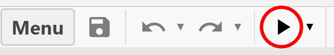

游戏规则为：使用鼠标控制玩家的方向，使用上下左右方向键移动玩家，点击鼠标左键发射子弹。
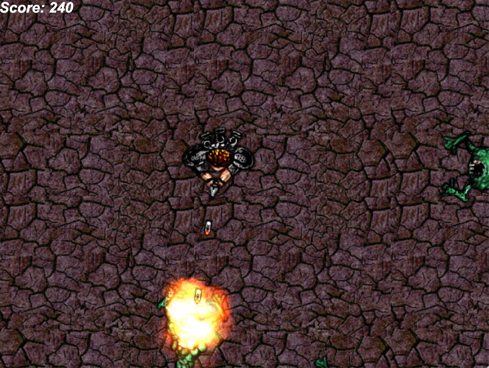

体验完毕之后，我们就可以正式开始接下来的教程了。

# 寻求帮助

如果你遇到任何困难、问题，都可以前往论坛。我们禁用了本教程的评论，因为这些评论可能很容易被大家忽略，在论坛里面，你会得到更多有用的回复。

# 开始

使用浏览器打开[Construct3编辑器](https://editor.construct.net/)， 没错，是运行在浏览器中的！不需要其他任何的安装或者设置。如果打开后提示一些错误，请检查系统环境要求页面，您可能需要更新您的浏览器或者电脑系统。

## 创建一个新项目

点击`New Project`按钮
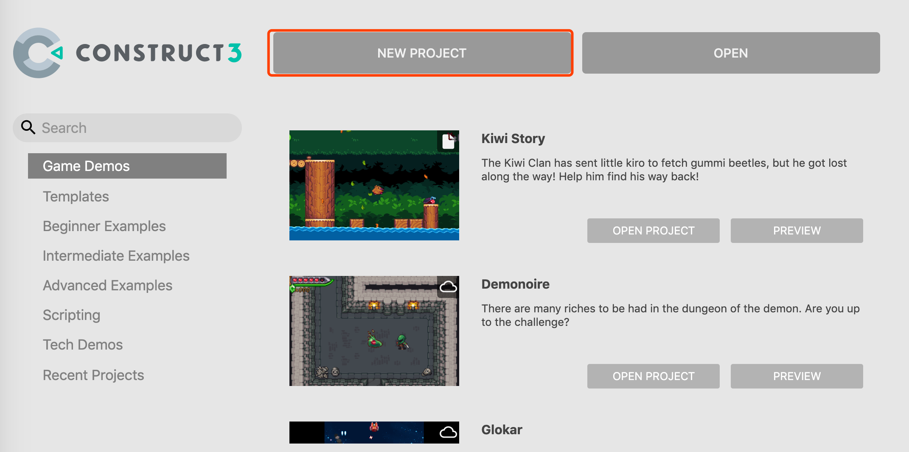
将会出现一个对话框，这里你可以对项目细节进行设置，我们先使用默认的设置，项目名字设置为`Hello-C3`
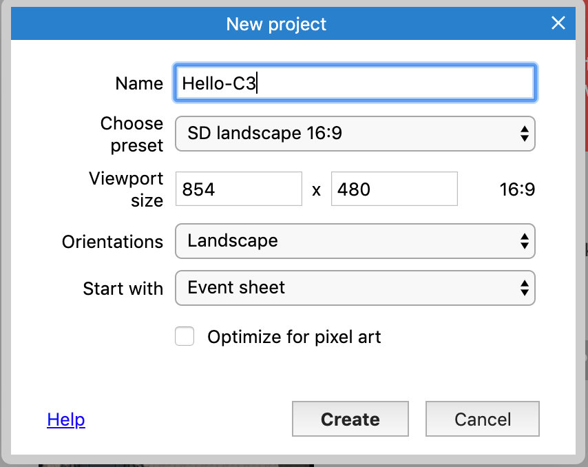
然后点击`Create`按钮，就会生成一个新的空项目，如图所示：
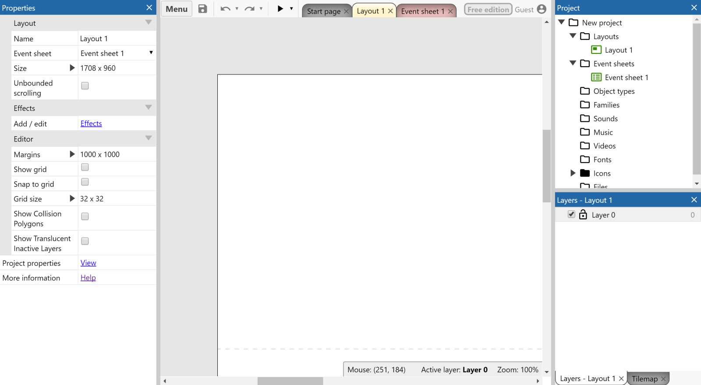
`注意屏幕截图：我们在Construct3中使用了默认的主题，如果您改变了主题，可能和图示不太相同，不过不用担心，这完全不会有任何影响。`

屏幕中间的主视图是布局视图（layout view），它是用来创建和摆放对象，可以简单的理解为游戏关卡或者屏幕菜单。在其他工具里面，可能被称为房间、场景、框架。

# 添加对象

让我们先添加一个游戏背景图吧。

## 平铺背景（Tiled Background）
每个游戏都有背景图，一般背景图都比较大，而且是规律性的重复，那么我们就需要在屏幕上重复平铺一张图片，而平铺背景对象就能满足需求。

首先，右键单击下边这张背景图，然后保存到你的电脑上。    
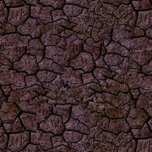

现在，双击布局中的空白处，会打开对话框：创建一个新的对象，双击选择平铺背景对象（Tiled Background）。
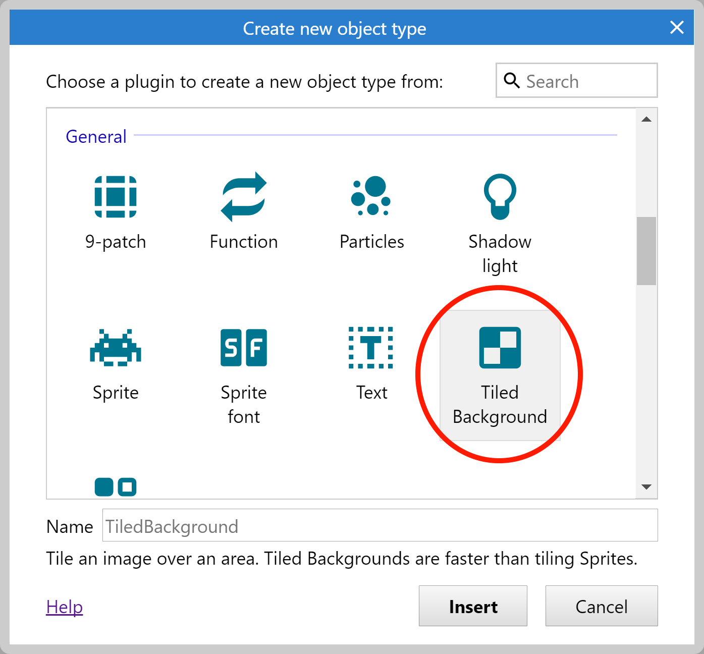

鼠标将变为十字线，指示放置对象的位置。点击布局视图中间的某个地方，会打开新的对话框
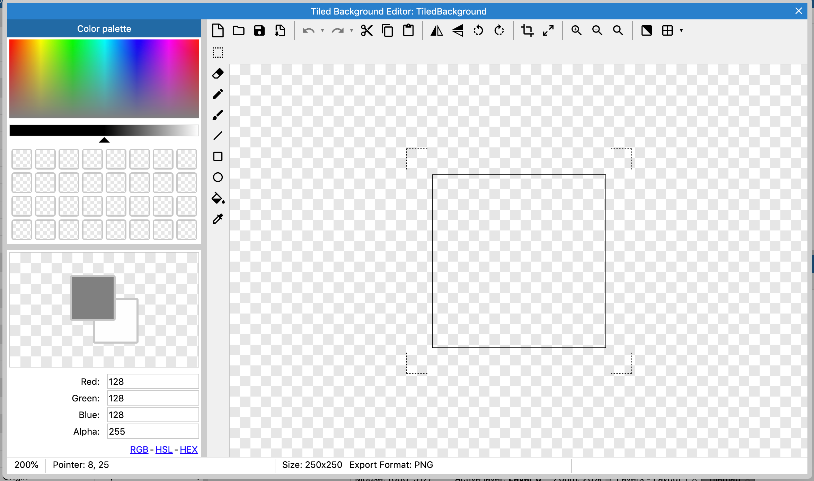

你可以在该对话框绘制或者导入图片，这里，我们导入之前保存的背景图，单击文件夹图标，找到刚刚保存的背景图文件，并选择它。
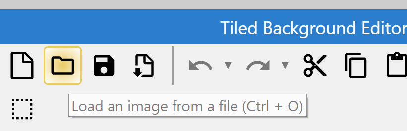

导入完成后，我们点击对话框右上角的关闭按钮。现在布局中就能看到刚刚选择的背景图片。让我们试着调整下它的大小，使用鼠标选中背景图，然后我们会在左边的属性栏看到显示对象的所有属性。我们将它的位置设置为(0,0)左上角，大小设置为1708x960（默认的可视区域大小为854x480）。
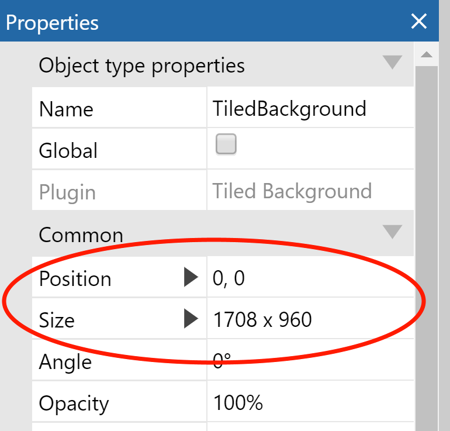

让我们来整体浏览下我们刚才的工作内容。按住`Ctrl`键并向下滚动鼠标滚轮可以缩小，或者右键选择`View→Zoom out`来进行缩放，同样您还可以按住空格键或者鼠标中建来移动。
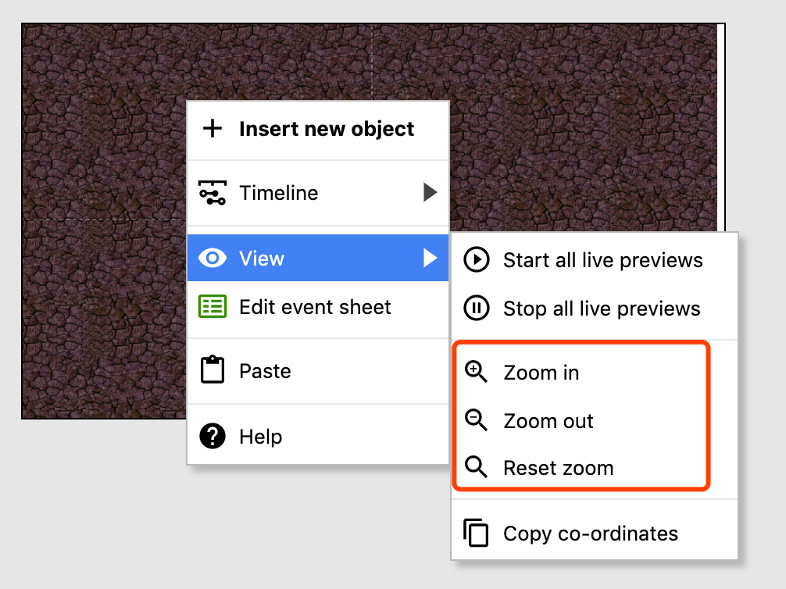
现在，您的平铺背景现在应该已经覆盖了整个布局视图：

按下`Ctrl`+`0`或者右键选择`View→Reset zoom`返回到`1：1`的视图。

（如果你像我一样没有耐心，可以直接点击工具栏上的预览按钮，然后弹出预览窗口，你就能看到平铺背景了）
