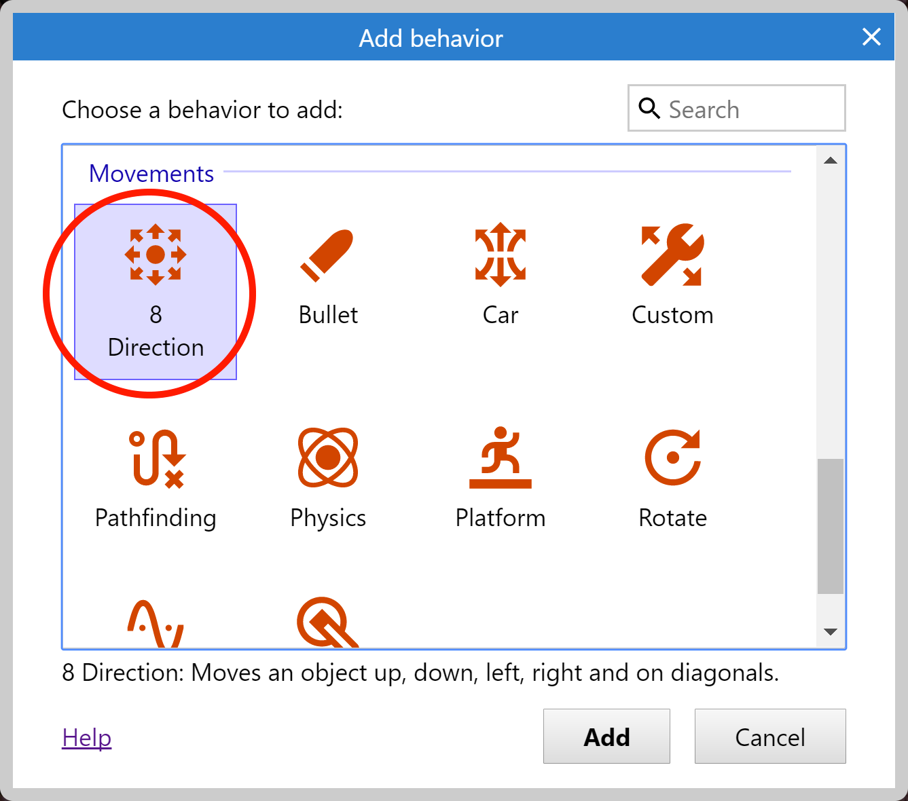

# 添加`behaviors`(行为)

`behaviors`(行为)可以使对象快速拥有某种行为表现。

比如你可以给对象添加一个`Platform`(平台)行为，接着给地板添加`Solid`(固体)行为，然后你就可以像一个平台跳跃游戏一样跳来跳去。

当然你也可以在`event`(事件)中实现同样的效果，但是行为更快速简单！

在Construct3中有很多行为可供选择使用，以下是在本教程中使用到的部分行为：
- `8 Direction`:你可以使用方向按键来自由移动一个物体，比如游戏中使用方向键控制玩家的移动。
- `Bullet`: 物体会像玩家射击的子弹那样，沿着当前方向一直前进移动，当然你也可以用来移动游戏中的怪物，因为它们都是以一定的速度运动的。
- `Scroll To`: 屏幕会始终跟随对象移动，如果你想让玩家始终显示在屏幕的中间，那么使用这个行为就再合适不过了。
- `Bound To Layout`: 该行为将阻止对象离开指定的布局区域，就像一个盒子一样，玩家仅限在盒子的区域移动。
- `Destroy Outside Layout`： 当物体离开布局区域时销毁它，比如我们希望子弹离开指定的区域后摧毁。如果没有他，那么子弹将飞出屏幕，而且不会销毁，这将会永远的占用部分内存，如果子弹比较多的话，可能对游戏性能也会产生影响。
- `Fade`：使物体具有淡出效果，比如爆炸后的消失

了解了以上的行为后，让我们把他们添加到需要的对象上吧！

## 如何添加行为

首先我们给玩家添加一个`8 Direction`行为。  

点击选中玩家对象，在属性栏中会发现有`Behaviors`(行为)分类，点击`Behaviors`链接，编辑器将打开如图的行为对话框界面：

点击`Add new behavior`，双击`8 Direction`行为完成添加：

再次执行同样的操作，这次添加`ScrollTo`行为，使屏幕始终跟随玩家，然后再添加`BoundToLayout`行为，使玩家的活动范围仅限指定的区域。最终你的行为对话框应该如下图所示：

关闭行为对话框，现在我们尝试着按`Preview`来预览下游戏效果，你可以使用方向键来移动玩家，并且屏幕会跟随玩家的移动。并且因为`BoundToLayout`的原因，玩家不能移动到布局外。

这就是行为的方便之处，你可以为不同的对象快速添加相同的行为。

后续我们会使用事件系统来添加自定义的行为。

# 添加其他行为

我们可以通过相同的方法想其他对象添加行为：选中对象，然后单击行为链接，打开行为对话框，并添加一些行为。
让我们添加以下的行为吧：

1. 为子弹对象添加`Bullet`和`Destroy Outside Layout`行为，

2. 为怪物对象添加`Bullet`行为，因为游戏中怪物是慢慢移动前进的。

3. 为爆炸对象添加`Fade`行为，因为爆炸在出现后悔慢慢消失。默认情况下，`Fade`行为会在行为结束后自动销毁对象，这样就能节省游戏的内存，保证游戏的流畅性。

如果你运行游戏后会发现子弹和怪物的移动速度一样快，让我们调慢一点怪物的移动速度。

选择怪物对象，注意，此时的属性栏因为已经添加了`Bullet Movement`行为，里面出现了一些额外的属性：

在这里我们就可以调整行为的具体参数，我们将`Speed`(速度)从400调整为80（以每秒移动的像素为单位）。

同样，我们改变子弹的速度为600，爆炸对象的`Fade out time`（淡出时间）为0.5s

# 生成更多的怪物

按住键盘的`Control`键，单击并拖动怪物对象，这时将会复制生成一个新的怪物对象实例。

我们使用`Control`+鼠标拖动，快速创建多个新的怪物吧，注意，怪物的位置尽量离玩家远一点，否则游戏可能刚开始，玩家就会马上死亡。你可以使用`Control`+鼠标滚轮来放大缩小布局，这样可以帮助你更加方便的调整细节。

最终的效果如图所示:

对象的本质是对象的类别。在事件系统中，主要处理的就是对象。

例如你可以创建一个事件，名字叫做`子弹和怪物相撞`，这意味着任何子弹对象的实例，和怪物对象的任何实例发生碰撞，而不是为每一个怪物对象制造一个单独的事件。

我们将在后续详细讨论这方面的内容，现在你可以理解为不同类型的敌人是不同的对象类型，而实际的敌人对象是这个敌人类型的一个实例。

接下来，我们就需要使用事件来添加我们自己的游戏逻辑，在事件系统中，Construct提供了可视化编程方案。

