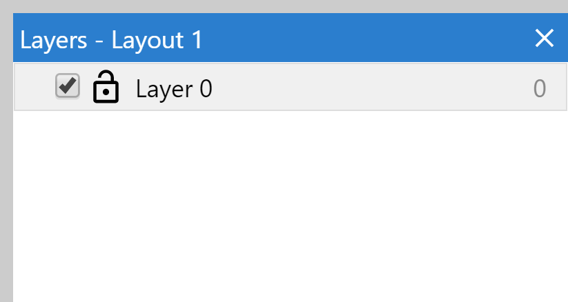
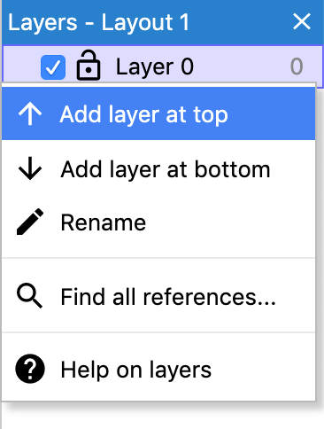
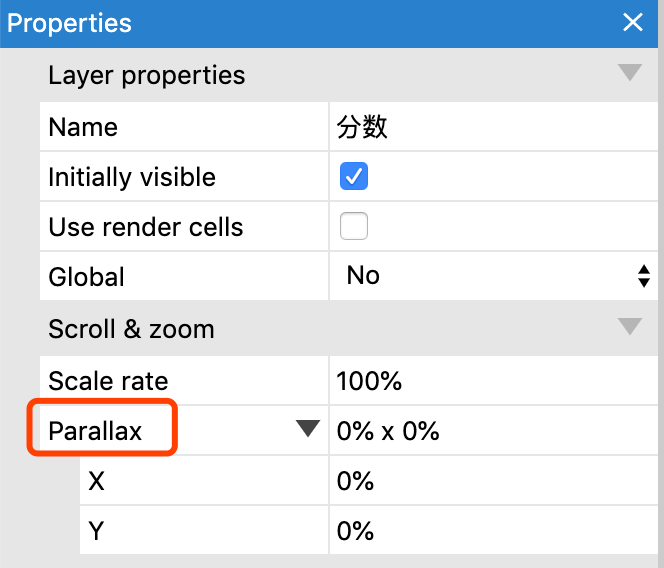
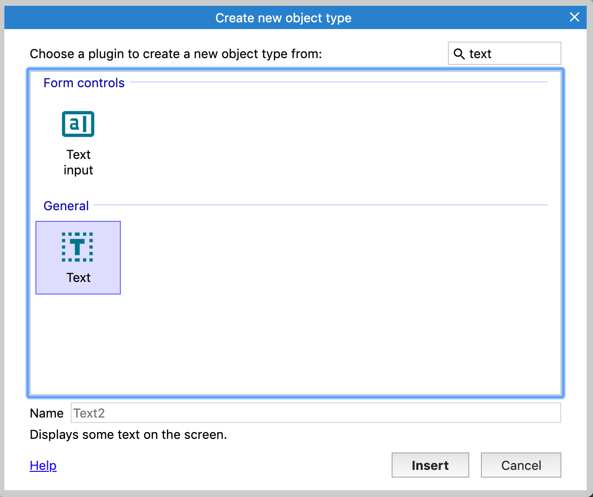
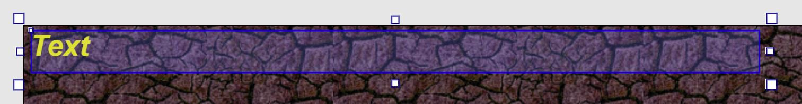
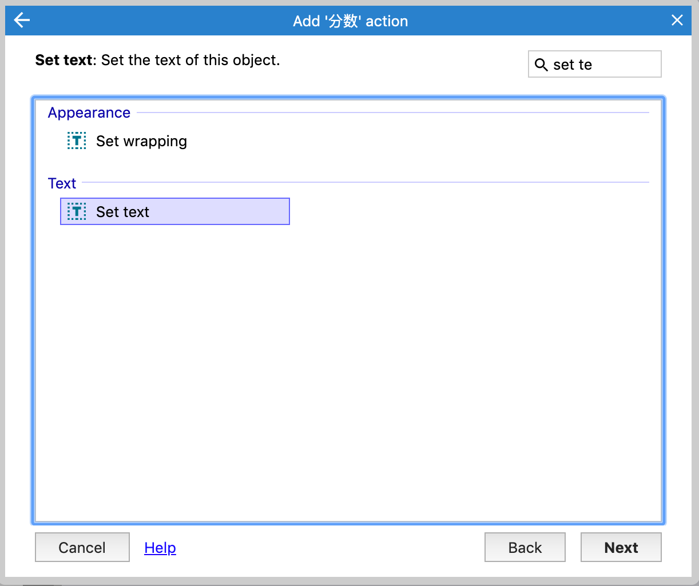
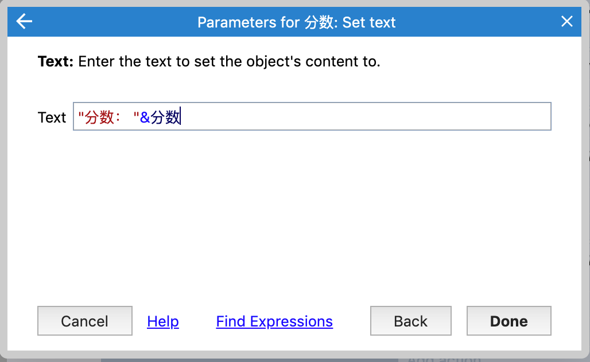
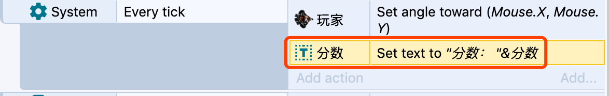

# 展示分数

文本对象可以显示分数。一般分数都是出现在屏幕的固定位置，而当前的游戏视图，默认是跟随玩家的，我们不希望玩家的移动，影响分数的显示位置，所以，我们需要新添加一个图层。

# 增加一个图层

布局可以包含多个图层，这样你就可以为对象分组。你可以想象为一层又一层的玻璃，叠加在一起，每一层上都有不同的画面。图层可以自由的调整层级关系，实现前后遮挡的效果，也可以隐藏，锁定等等。

这里我们把分数放在一个新的图层，并且这个图层在顶层。

下图是图层栏，在默认的面板布局中，它是在屏幕的右下角：

右键单击图层，选择`add layer at top`创建新图层，新图层名字叫做`分数`

# Parallax属性

默认情况下，图层时跟随着视图的移动而移动，而图层的`Parallax(视差)`属性可以调整移动效果，允许不同的图层以不同的速度滚动，产生一种伪3D的效果。

这里我们不希望`分数`图层移动，`分数`图层应该始终在屏幕的固定位置，所以设置Parallax(视差)为0即可。

注意，在设置图层属性的时候，请务必确认选中正确的图层。

# 添加文本对象

我们切换到布局视图，确保当前是`分数`图层。

双击空白区域，这次我们添加`Text`对象

将text对象放在布局的左上角，然后调整属性，设置为粗体，斜体，黄色，并选择一个稍微大点的字体。

调整宽度，保证所有文本都能显示。

切换到事件表中，我们需要及时更新玩家的分数，在前面添加的`Every tick`事件中，对分数对象添加`set Text`。

使用`&`，我们可以将一个数字转换为文本，并将其连接到另一个文本字符串。因此，我们可以这样输入`"分数："&分数`

- 第一部分的`"分数："`是自定义的字符串，注意，字符串必须用双引号
- 第二部分是全局变量`分数`的实际值。

最终事件修改如下图所示：

运行游戏，每次击杀一个怪物，你的分数就会及时刷新，并且分数始终在屏幕的固定位置。

