# 事件

首先点击顶部的`Event Sheet 1`选项卡切换到事件表单预览，这里展示了所有的事件，在你的游戏中，不同的游戏对象可以拥有不同的事件表单。

事件列表里面还可以嵌套其他事件，这样你就能重复使用，本教程中暂时我们先不事件嵌套事件。

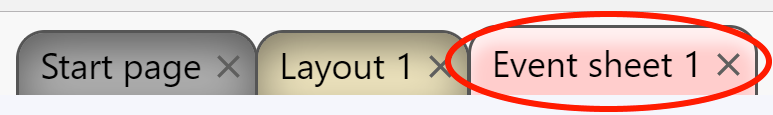

# 关于事件的说明

当你新建一个空事件表单时，Construct会有一些提示
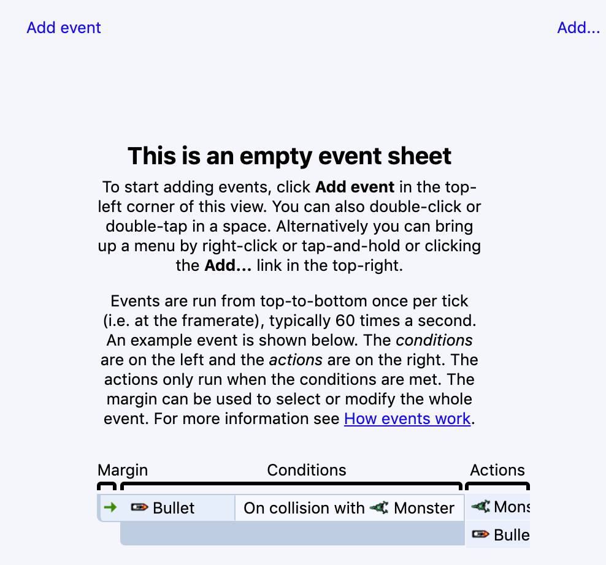
大概意思是说，游戏的每一帧都会运行一遍事件表单里面的所有事件。
Construct会尽量最平滑的刷新游戏，通常游戏每秒刷新60帧，即事件表单每秒运行60次，每次刷新都会重新绘制游戏。

事件的执行顺序是从上到下，因此顶部的事件是最先运行的。

# 条件(conditions)，动作(actions)，子事件(sub-events)

事件由条件组成，当条件满足时就会触发事件。

例如条件是`是否按下了空格键？`，当按下空格键时，就会运行事件对应的所有动作(actions)。

在所有的动作执行完毕后，紧接着子事件(sub-events)就会执行，这些子事件也可以包含多个条件、动作，子事件。

事件系统可以让我们的游戏逻辑变得更加多样、复杂。

本教程中，我们暂且先不使用子事件。

总结一下，一个事件的运行流程大致如下：
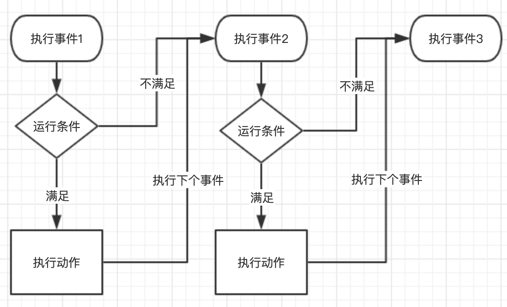

图示是一个简单概括的流程，目前来说，你可以大致认为流程是这样的，当然Construct也提供了许多事件特性来满足你的不同需求。

# 你的第一个事件

我们希望玩家始终朝向鼠标的位置，如图所示，你需要如下设置：

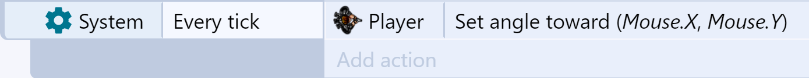

请注意，游戏的每一帧画面都是重新绘制的画面，如果玩家每一帧都朝向鼠标的位置，那么游戏运行时，看起来就像玩家始终朝向鼠标。

让我们开始制作这个事件吧。双击事件表单中的空白区域，会弹出添加条件(condition)的对话框:

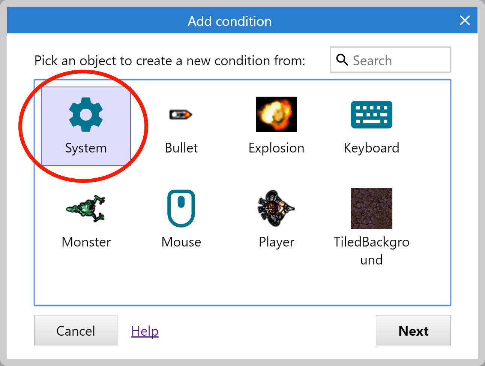

不同的对象允许拥有不同的条件和动作，条件和动作直接决定了对象的运行表现。

`System`是Construct的内置特性，我们双击`System`，如下所示，对话框会列出来所有的条件：

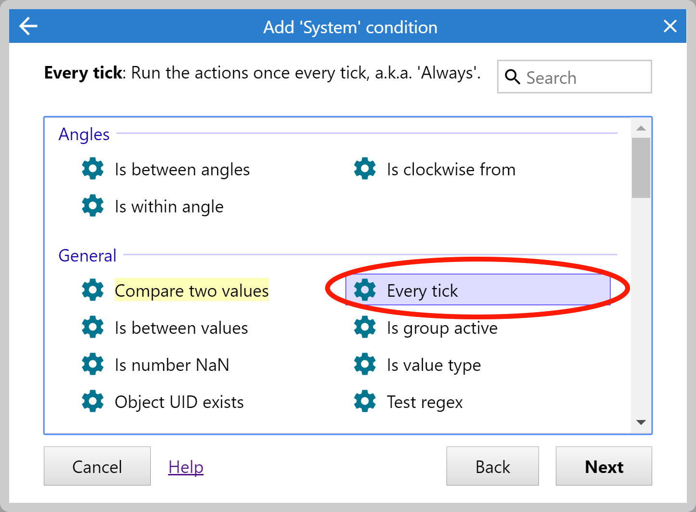

这里我们双击`Every tick`条件，也就是每一帧都会执行这个事件，这样就完成了事件的创建。

现在我们需要添加一个动作，让玩家看着鼠标。单击事件右侧的`Add action`链接
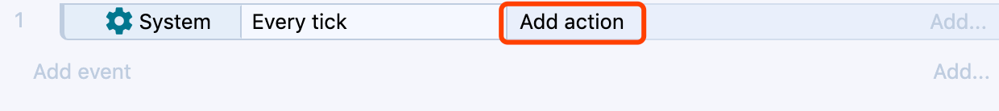
会打开如下对话框

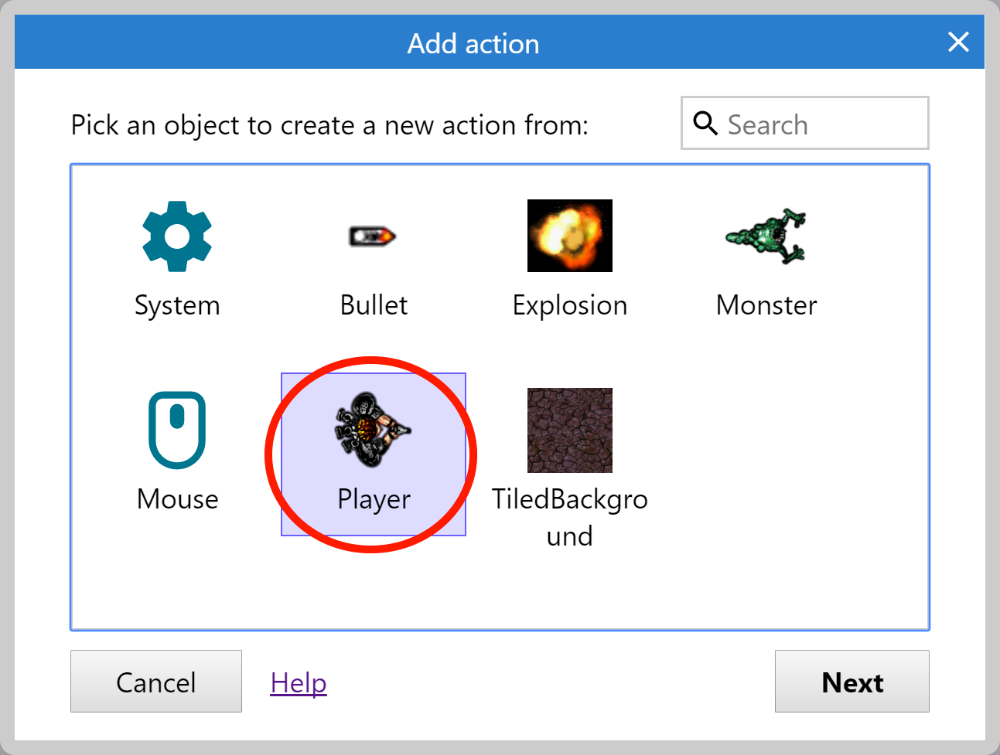

和添加事件一样，需要选择一个对象，这里我们选择之前我们创建的游戏玩家对象，双击后会弹出添加行为对话框：
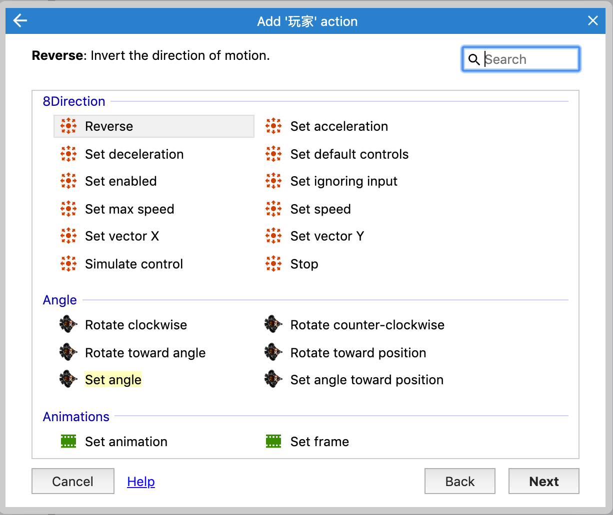

你可能注意到`8 Direction`也有了自己的动作，我们暂时先不关心这个问题，这里我们选择`set angle toward position`(设置朝向指定位置的角度)，这里我们没有使用`set angle`(设置玩家的朝向角度值)，因为这样满足不了我们的需求。
而`set angle toward position`会自动计算玩家位置和指定位置的角度。

我们这里选择如图所示的选项：

双击后会要求我们填写坐标，X、Y字段可以认为是该动作的参数，条件也是可以有参数的，只不过`every tick`条件是没有参数的。

现在我们想要设置设置角度朝向鼠标，而鼠标对象`Mouse Object`提供了这些功能。如下图所示:
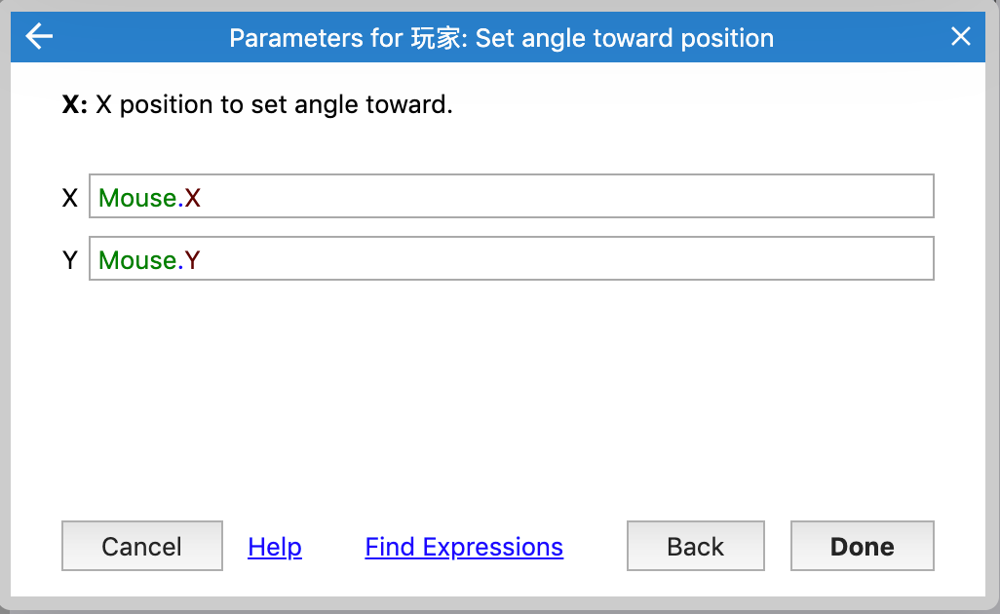
输入的`Mouse.x`和`Mouse.y`被称为表达式，你还可以输入`Mouse.x+100`或者`sin(Mouse.x)`的计算表达式，通过这种方式，你可以使用任何数据来参与计算。

表达式使得Construct十分灵活强大。

注意：如果出现`Mouse is not an object name`，请确认你已经添加了`Mouse Object`
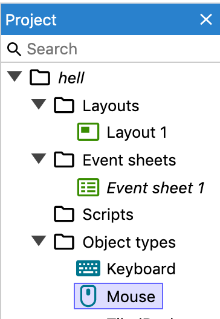

这里你可能会疑惑，难道我要记住所有的输入表达式么？

不用担心，Construct在你输入时，会自动给出提示可用的输入列表来帮助你自动完成输入，并且会对象都拥有什么属性可供使用。

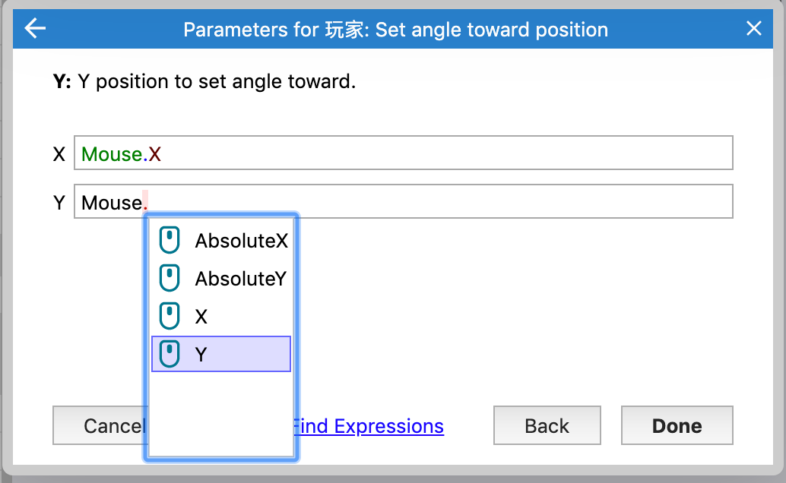

如果你不确定有哪些表达式可以输入，你可以点击`Find  Expressions`查看所有的可用表达式列表，直接双击某个表达式，同样也会自动完成插入。

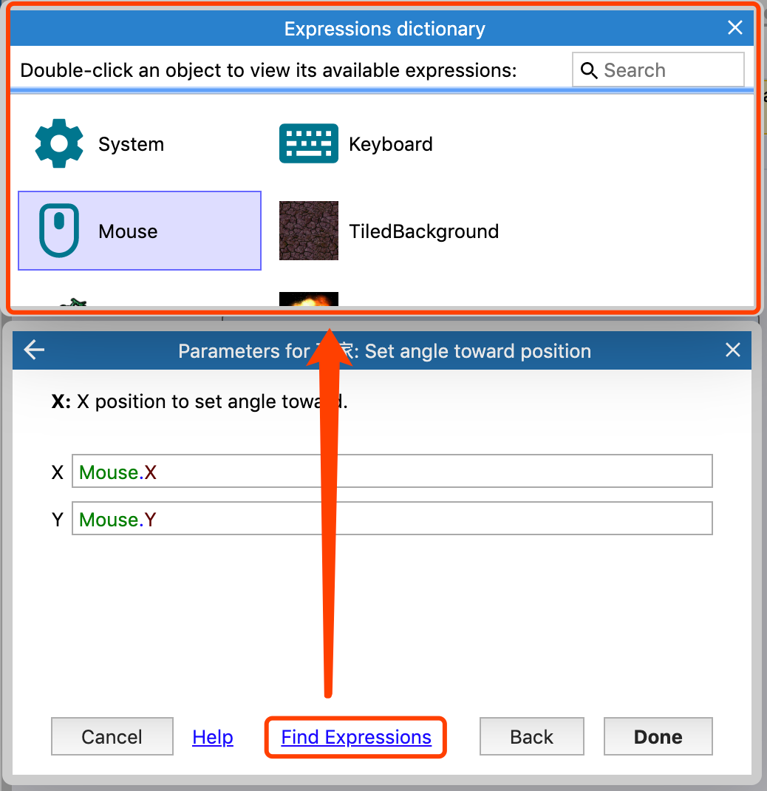

至此，就完成了你的第一个事件，最终如图所示:

运行游戏，你就会发现玩家会使用面对鼠标的位置，恭喜你完成了第一个自定义逻辑！

