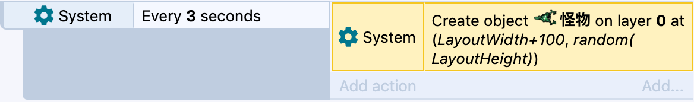
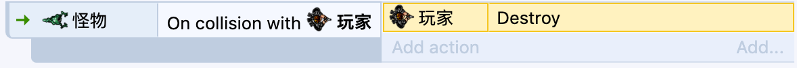
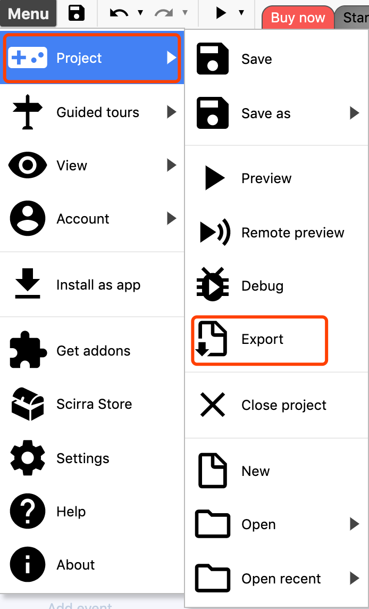
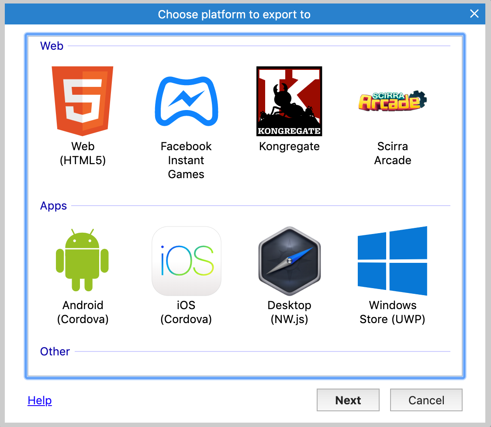

# 最后的优化

运行游戏后，你会发现一旦杀死了所有的怪物，就不会再有任何怪物了，我们可以每3秒创建一个新的怪物。

添加一个新的事件：

添加条件: `System->Every X seconds->3`

添加动作：`System->Create Object->怪物，layer0，x:layoutWidth+100, y:random(LayoutHeight)`

注意，这里我们创建的怪物，默认位置是在布局的最右边随机位置，为了保证不会突然出现在边缘，所以+100，这样看起来就像真的从外面进来。

我们还可以实现，如果玩家碰到了怪物就会死去

添加条件：`怪物->on collision with another object->玩家`

添加动作: `玩家->Destroy`

到此为止，本教程就完结了，如果你要预览完整的游戏，可以[点击这里](https://editor.construct.net/#open=ghost-shooter-tut)，或者在开始页搜索`Ghost Shooter`(幽灵射手)。

# 更多可以尝试的想法

以下提供了游戏的额外玩法，可以尝试着实现：
- 玩家击中怪物也可以获得分数，当然杀死怪物分数更高。并且每个怪物的分值也是不同的。
- 怪物随着时间的加速，移动速度会越来越快。
- 增加新类型的敌人。
- 添加心得武器，玩家可以进行切换。
- 增加一些游戏声音，比如怪物死亡声音，子弹射击声音等。
- 增加游戏开始，游戏结束等界面。
- 增加一些障碍物。

# 结尾

恭喜你已经完成了在Construct3制作的第一个游戏，如果你想要分享给别人，可以导出

发布到你想要分享的平台上

# 接下来如何深入学习
- 可以看下这个教程：`入门教程：如何学习Construct3`，这篇教程将由浅入深，让你深入了解Construct3
-  查阅Construct3的使用手册
- 浏览起始页的示例，里面包含了所有的Construct3特性
- 论坛交流

