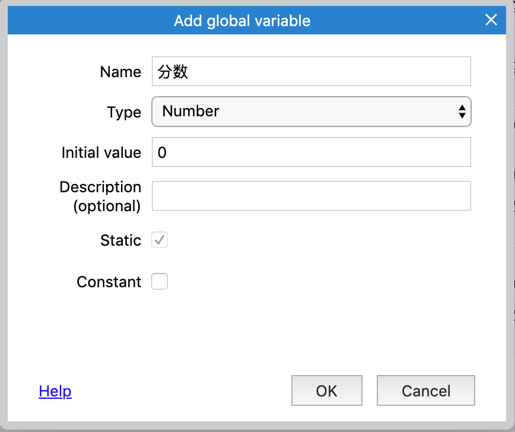
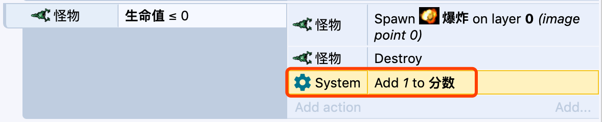

# 记录分数

当玩家每杀死一个怪物，我们就记1分，所以我们需要有一个分数的变量，但是在Construct里，变量都是存储在对象里面的，如果我们把分数变量放在玩家对象里面，当玩家对象死亡销毁时，就无法得知分数了。

因此，我们不能将分数变量放在玩家对象上，我们可以使用全局变量。

右击事件底部的空白部分，选择`add global variable`

名字我们输入`分数`，初始化设置为0，其他字段默认即可。

创建完成后，全局变量在事件中显示为一行，在这个事件表单中，任何事件都可以访问这个变量

让我们再修改下事件，当怪物的生命值<=0时，

添加动作：`System->Add to->生命值，value:1`

最终事件如下图所示：

现在，每次杀死一个怪物，分数就会+1，但是这个分数并没有在游戏中显示，下一节我们会用一个文本来展示这个分数。
