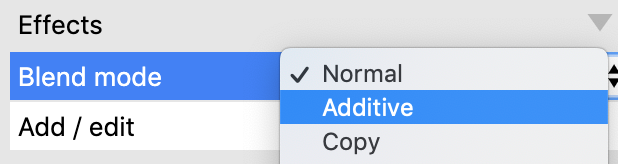

# 添加更多的游戏逻辑

如果每个事件都像之前那样详细的描述，那么本教程将会非常长。

让我们简单总结下之前是如何添加设置事件的：
1. 双击或者单击`Add action`，插入一个新的事件。
2. 双击对象设置条件`(condition)`/`动作(action)`
3. 双击自己想要的条件`(condition)`/`动作(action)`
4. 如果有参数，填写下参数

可以看到事件之后，紧跟的是条件`(condition)`/`动作(action)`，之后是所需要的参数。
那么，上篇教程中插入事件的流程可以这样描述：
- 添加条件：`System->Every tick`
- 添加动作：`玩家->Set angle towards position`，并且设置参数`x:Mouse.X, y:Mouse.Y`

# 让玩家开枪

一般，游戏中当玩家点击鼠标的时候，可以进行射击。

我们可以使用`Spawn an object`动作实现这个功能，该动作会在相同的位置和角度创建一个新的对象实例。

我们之前已经为子弹对象添加了一个`Bullet`，子弹会一直向前运行，现在我们需要再给子弹对象添加一些事件：

添加条件： `Mouse->On Click->Left Clicked(默认)`

添加动作：`玩家->Spawn another object`，选择子弹对象，使用默认参数即可。

操作完毕后，事件列表应该如下图所示：

此时如果你运行游戏，就可以射击子弹了。

但是你会发现子弹时从玩家的中间发射出来的，我们希望子弹时从枪口发射出来。

我们可以在枪口放一个图像点，图像点只是图像上的一个位置，方便我们从这个位置生成新的对象，我们在`Spawn another object`动作中引用这个位置即可。

在项目栏(project bar)中右击玩家对象，选择`Edit animations`(编辑动画):

在图像编辑面板中，单击图像点工具：

注意观察`Image Points`面板，里面列出了所有的图像点：

其中`Origin`是图像默认的原点，当物体进行旋转时，就会围绕`Origin`来旋转。

这里我们不使用`Origin`，右键新建一个图像点

然后将点设置到枪口，如下图所示

关闭图像编辑器，在`event sheet`中双击修改`Spawn an object`动作，并将图像点修改为1：

注意，这里的`1`表示第几个图像点，并不是图像点的名字。

再次预览游戏，子弹就从枪口中射出来了。虽然子弹现在还不能击杀怪物，不过，一旦你理解了事件系统，就可以很快的组织好你想要的逻辑。

下面，让我们的子弹杀死怪物吧，添加以下事件：

添加条件：`子弹->On Collision with another object->怪物`

添加动作：`怪物-> Destroy`

添加动作：`子弹->Spawn another object->爆炸`

添加动作：`子弹->Destroy`

最终完成效果如图所示：

预览游戏，射击一个怪物，你会发现爆炸有个黑色的边框！

我们单击项目栏中的爆炸对象，修改`Effect`的混合模式为`Additive(叠加)`即可。

再次运行游戏，爆炸就正常了。

为什么会这样呢？一般情况下，图像时直接呈现到游戏中，但是在混合模式下，相同位置图片(也就是爆炸图片和背景图片)的每个像素都可以进行运算，黑色的颜色值为0，0和任何颜色值相加还是原颜色，所以，爆炸的黑框就消失了。

#  让怪物更聪明一点

现在这些怪物只是从布局边上移动到了右边，不够有趣，我们可以让怪物随机位置出现。

添加条件: `System->on start of layout`

添加动作：`怪物->set angle`，参数为`random(360)`

这样有一个问题，当怪物离开布局的时候，就永远离开了，再也回不来了，不过我们可以让它始终呆在布局里面。

我们还可以置当怪物离开布局的时候，让它们自动冲向玩家，这样就能保证怪物始终在布局内，如果玩家一直站着不动，那么怪物最终会冲向玩家！

添加条件: `怪物->is outside layout`

添加动作：`怪物->set angle toward position` X:玩家.X Y:玩家.Y

最终的完成样子如下图：

运行游戏，你如果停留一段时间，你就会发现怪物会停留在布局的边缘，并且它们随机朝向一个方向。
现在点击鼠标左键，就会射击子弹，如果子弹碰到怪物就会立刻击杀怪物，如果我希望怪物被子弹击中5次才会死亡，那么该怎么做呢？我们可以使用变量来做到！

