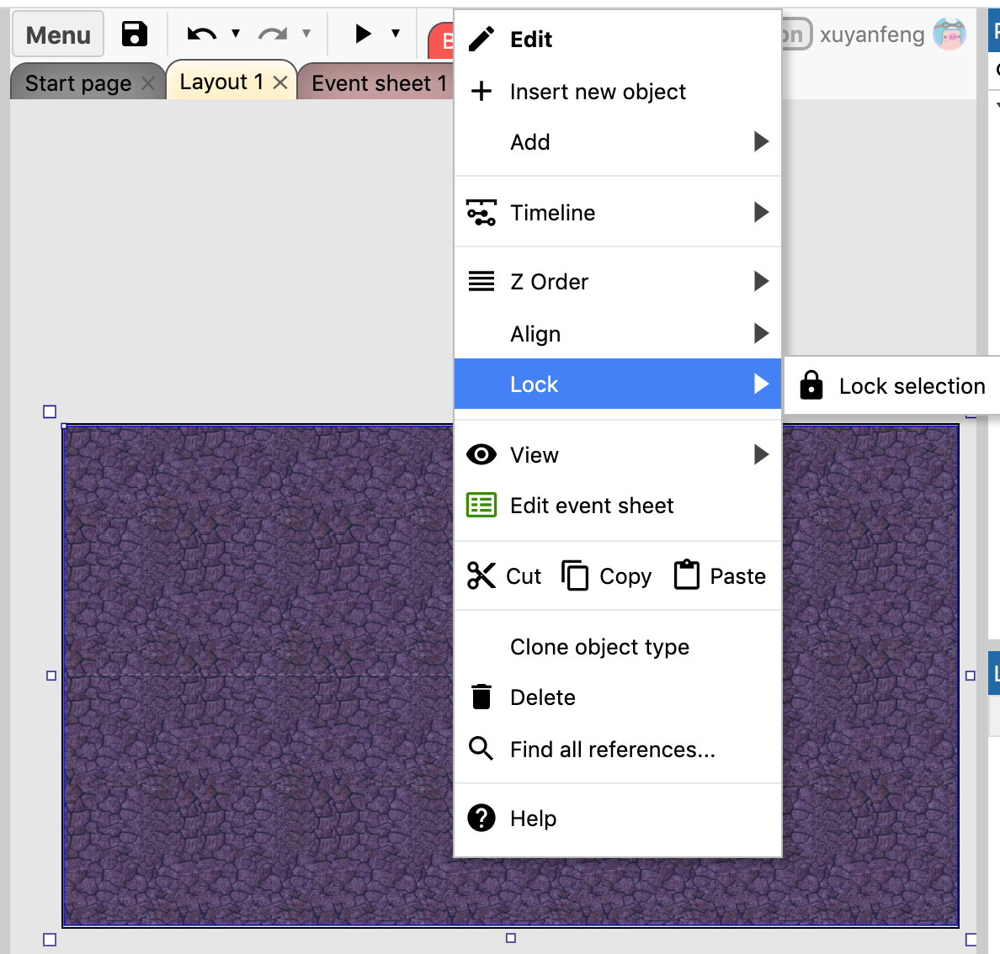
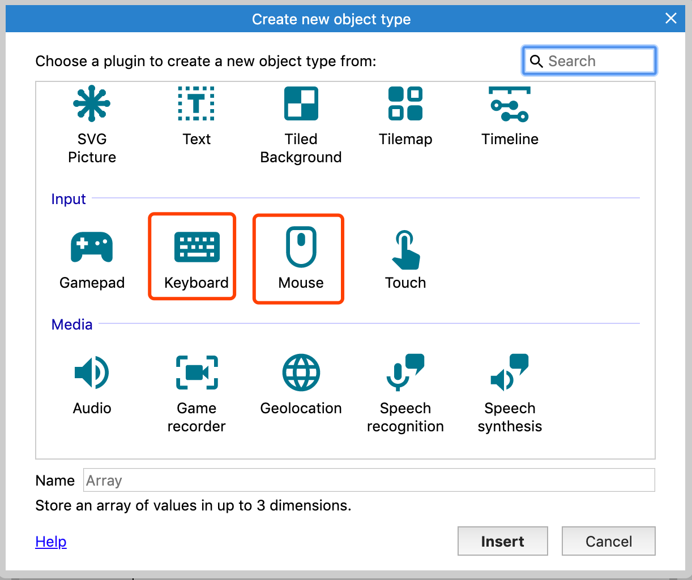
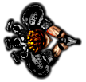
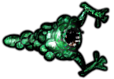
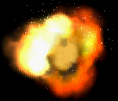

在我们继续之前，平铺背景应该被锁定。如果我们在上边创建移动对象时，很容易因为误选而修改到其属性，这时我们可以锁定它，使它不可以被选择，这样就不会影响我们的操作了。要锁定它，右键单击平铺背景，并选择锁定选项即可。

# 添加输入对象
双击空白处（因为平铺背景已经锁定，所以可以双击任何地方）添加另外一个新的对象。这次我们选择鼠标对象`Mouse Object`，然后同样的操作，添加一个键盘对象`KeyBoard Object`。

需要注意的是，这些对象不需要放置在布局中，它们是隐藏的，并且自动在整个项目中工作。现在，我们的项目就可以接受鼠标和键盘的输入了。

# 游戏对象

是时候添加我们的游戏对象了，下面是游戏中的图像，同样的我们需要保存图片到电脑上

以上每个对象，我们都需要添加一个精灵对象`Sprite Object`，精灵负责显示图像，可以移动、旋转、调整大小和可选动画。一般游戏都是由精灵对象组成，让我们将上面的四张图片分别插入对应的精灵对象吧，这个过程和插入平铺背景非常像：
1. 双击插入一个新对象
2. 双击选择精灵`Sprite`
3. 当鼠标变为十字线时，单击任何地方将其放置
4. 弹出图像编辑器对话框，单击`Load Image`加载图像按钮，选择刚刚保存的图片
5. 关闭图像编辑器对话框，现在已经可以在布局中看到精灵了

`注意： 创建精灵对象的另一种快速方法是将图片文件拖拽到布局视图中，Construct3会自动创建一个带有该图像的精灵。 一定要一次拖动一个图片，如果你同时拖动所有的4个文件，Construct3将生成一个有四个动画帧的精灵。`

我们需要移动子弹和爆炸精灵到布局的边缘，这样在游戏开始时，我们就看不到他们了。

为了方便识别对象，我们可以将刚才添加的4个精灵分别重命名为`玩家`、`怪物`、`子弹`、`爆炸`，选中对象，然后在属性（Properties）栏中修改`Name`属性即可：

