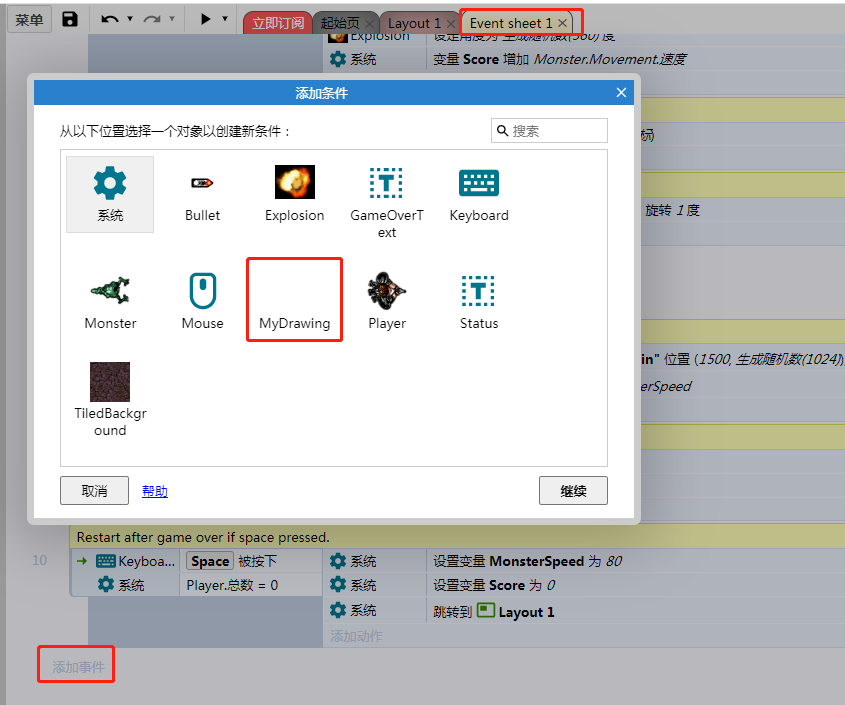
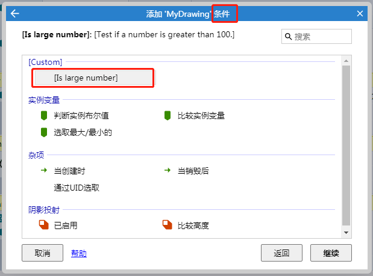
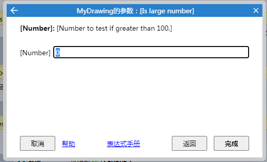
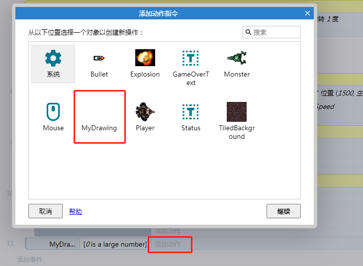
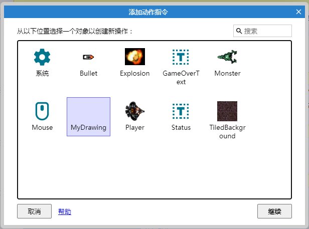
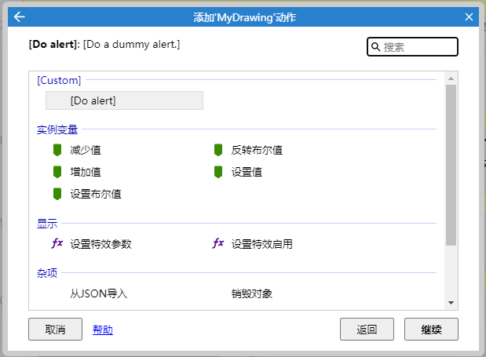
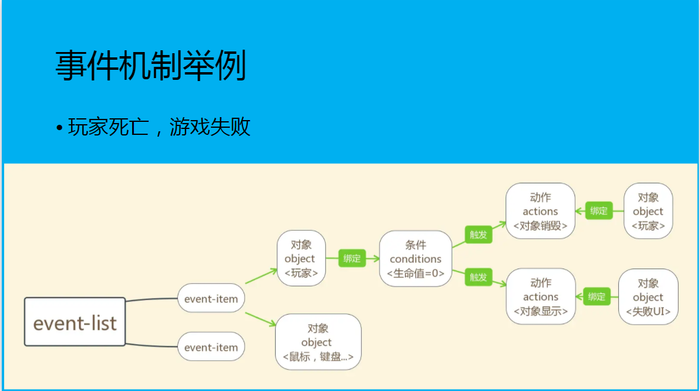

actions、conditions、expressions简称ACE，用来指一个动作、条件、表达式。


```
{
    'ace1': {
        'conditions': [],
        'actions': [],
        'expressions': []
    }
}
```
每个key都是类别ID，在编辑器中显示的字符，会从语言文件中查找

ACE中的每条数据都是一个json
```
{
	"id": "every-tick",
	"scriptName": "EveryTick"
}
```

ACE最小数据

|参数|conditions |actions|expressions|
|----|----|----|----|
|id|√|√|√|
|scriptName|√|√|-|
|expressionName|-|-|√|
|returnType|-|-|√|


- id
- c2id：construct2升级上来的
- scriptName / expressionName ：ACE运行时脚本中的函数名
- isDeprecated： true/false 是否废弃 
- highlight：设置为 true 以突出显示条件/操作/表达式选择器对话框中的 ACE。这应该只用于最常用的 ace，以帮助用户从列表中轻松地挑出它们
- params: 参数

## Condition特有的属性
- isTrigger：指定触发器条件。这将在事件表中显示箭头。触发器只有在它们是由运行时调用触发的明确时才运行，而不是计算每个滴答

- isFakeTrigger：指定一个假的触发器。这看起来与事件表中的触发器完全相同，但实际上是每隔计算一次。这对于对于单一刻度为真的条件非常有用，例如对于必须每刻度轮询一个值的 api

- isStatic： 通常，条件运行时方法对每个选定的实例执行一次。如果条件被标记为 static，则运行时方法只在对象类型类上执行一次。这意味着运行时方法还必须完全自己实现实例选择，包括考虑否定和 OR 块
- isLooping： 在事件表中显示一个图标，以指示条件循环。这应该只用于实现重新触发的条件
- isInvertible：允许条件在事件表中被反转。设置为false关闭逆变装置
- isCompatibleWithTriggers： 

## Action特有属性
- isAsync：将 action 标记为异步操作

## Expression特有属性
- expressionName 
- returnType："number", "string", "any"
- isVariadicParameters ：是否允许用户输入任意数量的参数


## Params参数
```
{
	"id": "compare-two-values",
	"scriptName": "Compare",
	"params": [
		{	"id": "first-value",	"type": "any" },
		{	"id": "comparison",		"type": "cmp" },
		{	"id": "second-value",	"type": "any" }
	]
}
```
>  expressions 只能使用 "number", "string" or "any"参数类型.

- id
- c2id:
- type:
    - number
    - string
    - any
    - boolean：布尔值，显示一个复选框
    - combo:下拉列表，必须指定item属性
    - cmp：下拉列表，包含大于，小于，等于
    - object：对象选择器，allowedPluginIds定义了筛选的对象
    - objectname：字符串，对象名字
    - layer：字符串，层名字
    - layout：一个包含项目中所有布局的下拉列表
    - keyb：按键拾取器
    - instancevar：包含对象具有的非布尔实例变量的下拉列表
    - instancevarbool：包含对象具有的布尔实例变量的下拉列表
    - eventvar：作用域中包含非布尔事件变量的下拉列表
    - eventvarbool：作用域中包含布尔事件变量的下拉列表
    - animation：对象中的动画名称
    - objinstancevar：
- initialValue：初始值
- items： 下拉数据数组，combo有效   
- allowedPluginIds：   设置为对象选择器允许显示的插件 id 数组["Sprite"] 

### ACES主要在事件表中使用
- 点击添加事件，从对象列表中添加事件的对象

- 为对象添加条件，这里就出现了插件中的`is-large-number`条件

- 接着为设置条件的参数   

- 设置完毕后，就会在事件表中出现一条新增的事件

- 接着为为这个事件添加actions

- 添加actions也需要指定执行actions的对象

- 这里我们仍旧选择插件的实例对象，当然你也可以选择其他对象

- 这里就出现了自定义的`do alert`，选择后，该事件如下所示


#### 图中我们可以推导出大概的事件机制：

