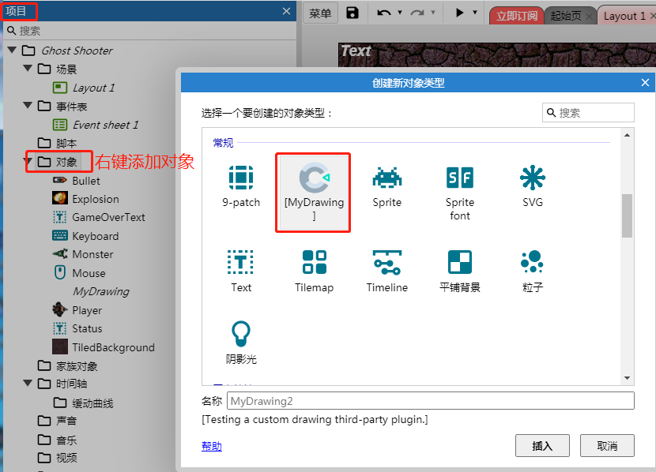

addon.json中定义了详细的插件信息
- is-c3-addon：true/false
> 布尔值：用于识别是否为Construct3的插件

- type："plugin"/"behavior"/"effect"/"theme"
> 插件的类型：

- name: 插件名字
- id：插件的唯一标识
- version：插件版本号
- author：插件作者
- website：插件的介绍网站
- documentation：插件的在线帮助文档
- description：插件描述，用户在安装插件时，会看到该信息。
- editor-scripts：编辑器要加载的文件，当type为plugin、behavior有效
>推荐使用默认的配置，如果你想把插件合并压缩到一个脚本中，或者你依赖了第三方脚本，你需要修改这个字段。
- stylesheets：编辑器使用的样式，当type为theme时有效
- file-list：插件使用到的所有脚本，在开发者模式下有效


```
{
	"is-c3-addon": true,
	"type": "plugin",
	"name": "My custom plugin",
	"id": "MyCompany_MyAddon",
	"version": "1.0.0.0",
	"author": "Scirra",
	"website": "https://www.construct.net",
	"documentation": "https://www.construct.net",
	"description": "Example custom Construct 3 plugin.",
	"editor-scripts": [
						"plugin.js",
						"type.js",
						"instance.js"
					],
	"file-list": [
		"c2runtime/runtime.js",
		"lang/en-US.json",
		"aces.json",
		"addon.json",
		"icon.svg",
		"instance.js",
		"plugin.js",
		"type.js"
	]
}
```
## effect类型插件的配置
当你在开发type为`effect`类型的插件时，`addon.json`中有关的字段配置，[参考这里](./addon.effect.md)

### 新添加的插件可以在这里看到



