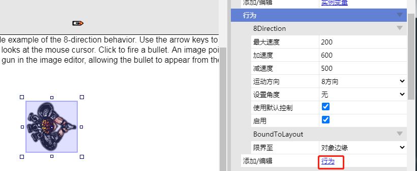
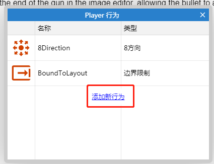
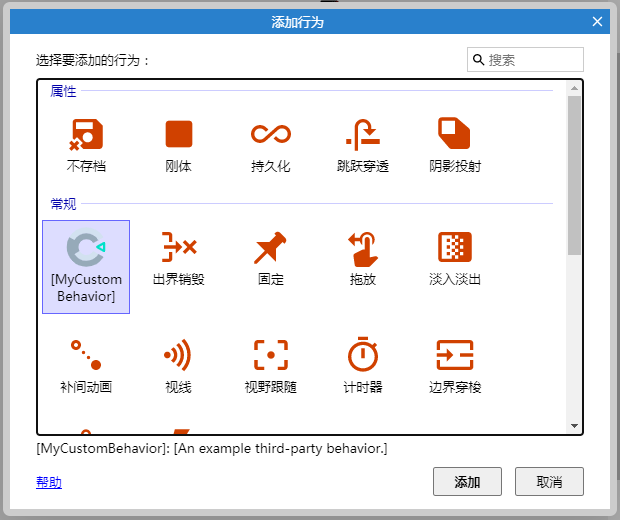
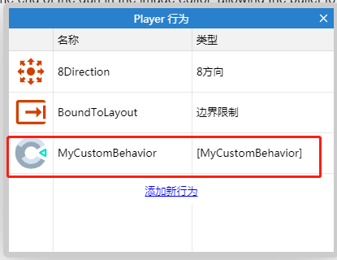
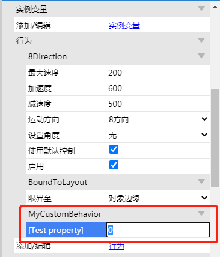

behavior.js主要配置行为

## 常量
```
const BEHAVIOR_ID = "MyCompany_MyAddon";
const BEHAVIOR_VERSION = "1.0.0.0";
const BEHAVIOR_CATEGORY = "general";
```
### BEHAVIOR_ID
必须和`addon.json`中ID的值相同

### BEHAVIOR_VERSION
必须和`addon.json`中version的值相同

### BEHAVIOR_CATEGORY
当在对话框中添加behavior，展示的行为类别，
可选值为：
- attributes
- general
- movements
- other
 

```
class MyCustomBehavior extends SDK.IBehaviorBase {
    constructor () {
        super();
    }
}
const BEHAVIOR_CLASS = MyCustomBehavior;
SDK.Behaviors.MyCompany_MyAddon = MyCustomBehavior;
```

在构造函数中，插件的配置是通过`this._info`设置的，这是一个[IPluginInfo]()的接口


当选中行为实例时，行为属性会出现在属性栏，你需要这样设置属性：
```
this._info.SetProperties([
	new SDK.PluginProperty("integer", "test-property", 0)
]);
```

- 在对象实例属性中，点击添加`behavior`




- 在常规中就会发现插件定义的`behavior`


- 双击即可添加


在刚才的对象实例属性中，即可看到这个`behavior`


