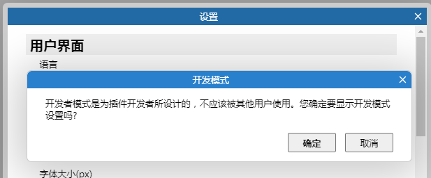
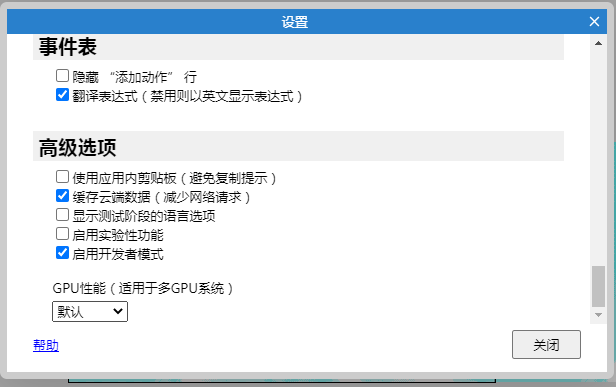
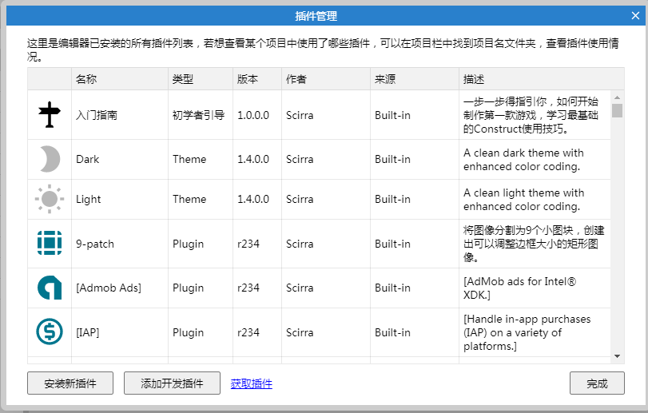
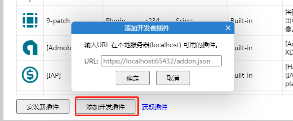
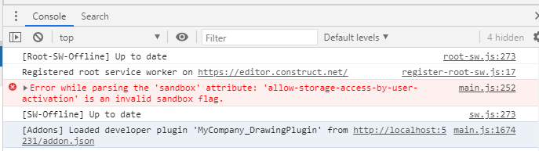

# 调试插件
### 1.启用开发者模式
打开设置对话框，点击标题栏10次

就会在设置中出现开发者模式

### 2.启动本地服务

你只需要将你的插件放在本地服务下，保证`localhost:8080/addon.json`能够被正常加载即可

### 3. 更新插件的`file-list`

### 4.安装插件
打开编辑器插件管理：菜单->视图->插件管理

当启用开发者模式后，会出现`添加开发插件`按钮，点击后，在对话框填写url即可(注意：填写localhost即可，ip可能会遇到各种问题)

安装成功之后，需要重启下编辑器，然后你会在console中看到这个插件被正确加载了

### 5.更新插件
如果插件代码更新了，修完完毕之后，你需要重新刷新下编辑器即可

# 插件示例工程
[开发插件的DEMO](https://gitee.com/tidys/construct3-plugin)
