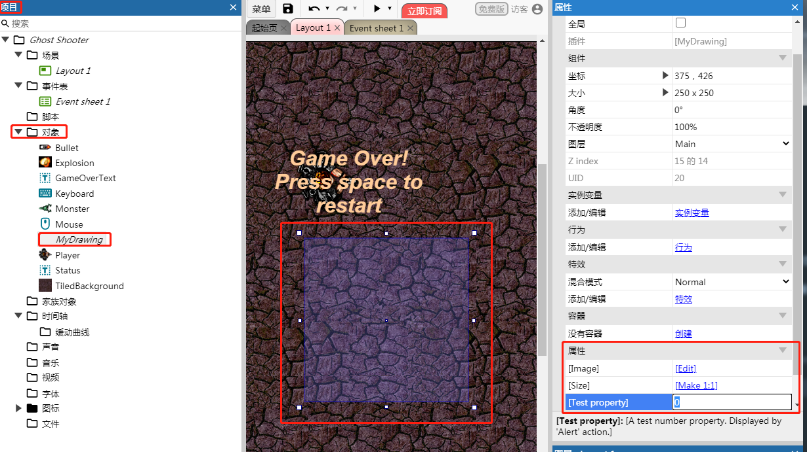
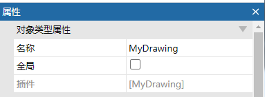

定义插件的对象

## 示例代码：

```
const PLUGIN_ID = "MyCompany_MyAddon";
const PLUGIN_VERSION = "1.0.0.0";
const PLUGIN_CATEGORY = "general";

class MyCustomPlugin extends SDK.IPluginBase {
    constructor () {
        super(PLUGIN_ID);
        this._info.setName("hello plugin");
        this._info.SetProperties([
        	new SDK.PluginProperty("integer", "test-property", 0)
        ]);
    }
}
SDK.Plugins.MyCompany_MyAddon = MyCustomPlugin;
const PLUGIN_CLASS = MyCustomPlugin;
```
> 在`type.js`、 `instance.js`中，我们会使用`SDK.Plugins`的`MyCompany_MyAddon`属性来获取插件实例，
  所以，如果这里发生了变化，记得同步更新

# 常量
### PLUGIN_ID
插件的唯一标识，必须和`addon.json`中的值相同，请尽量避免反复修改

### PLUGIN_VERSION
插件版本号，必须和`addon.json`中的值相同

### PLUGIN_CATEGORY
插件的类别，当创建一个新的对象类型时，会显示
可选的值为：

| value | desc |
| ---- | ---- |
|`data-and-storage`|-|
|`form-controls`|-|
|`general`|-|
|`input`|-|
|`media`|-|
|`monetisation`|-|
|`platform-specific`|-|
|`web`|-|
|`other`|-| 

### 插件的主类

在构造函数中，插件的配置是通过`this._info`设置的，这是一个[IPluginInfo]()的接口

通过`this._info.SetProperties`接口，我们可以为对象示例新增自定义属性。

当选中插件实例时，插件属性会出现在属性栏，具体编辑器中属性显示的文本，是从`lang`语言文件中读取出来的。
 


同时会看到这个对象来自插件`MyDrawing`


