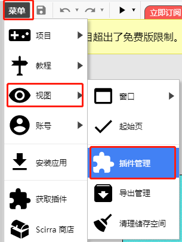
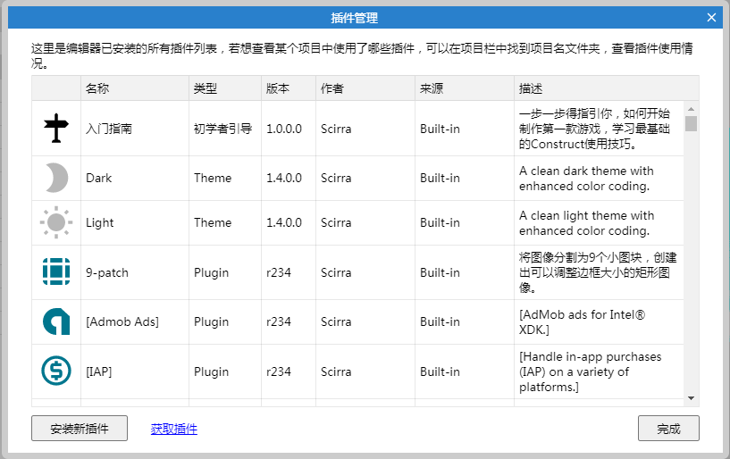

欢迎来到Construct3 JavaScript SDK文档。
JavaScript SDK允许开发者开发自己的Construct3插件，在插件里面，你可以创建自定义的`behaviors`、`effects`，甚至你可以修改编辑器的外观主题。
> 请注意，目前并非所有的SDK特性都有效，该文档后续可能随着新功能的推出同步更新

## 下载SDK
最后更新时间:2020年9月2日
- [插件SDK](doc/plugin/res/c3-plugin-sdk-v1-8.zip)
- [Behavior SDK](doc/plugin/res/c3-behavior-sdk-v1-5.zip)
- [Effect SDK](doc/plugin/res/c3-effect-sdk-v1-1.zip)
- [Editor Theme SDK](doc/plugin/res/c3-theme-sdk-v1-0-1.zip)

 
如果你想在Construct3编辑器中测试以上插件，你可以将插件的zip文件直接重命名为`.c3addon`，然后通过编辑器的插件管理加载插件。

在开发插件的时候，在本地HTTP服务器上使用[开发模式](./guide/develop-mode.md)，可以提高开发效率

## 自定义导入器API
[这个插件](doc/plugin/res/customimportersampledata.zip)包含了一个使用自定义导入器的例子
你可以直接将这个插件拖放到Construct3中，就能看到插件是如何读取自定义格式的。

## 你需要掌握web技能
插件是使用JavaScript编写，另外需要你掌握web技能(Html、Css)。
不过本文档不会去教你这些，需要你自己从网上搜索一些资料进行学历。

