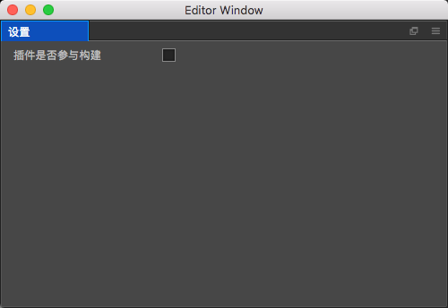

# 设置界面

## 插件是否参与构建
默认不参与构建,当然也不推荐参与构建项目    
在这里你可能需要简单了解下插件的工作原理,插件本身会向游戏中增加插件的逻辑,
而这部分逻辑在游戏启动的时候会发起一个socket网络请求,用来保持游戏和插件进行通信,
因为插件本身会建立一个socket服务,所以在creator环境下debug的时候,游戏是不受影响的,
但是如果游戏要对外发布安装包了,那么插件的这个机制可能就会直接让游戏跪掉,
所以这个功能就是为此设计的,对外暴露这个设置,是为了以后局域网联机调试节点
树而准备的   
另外特别需要说明一点,取消参与构建后,插件的源代码还会保留在发布后的游戏中,只是再也不会
被游戏加载到,当然也不可能会运行到,这点请大家放心,特别需要声明一点的是,以下情况,是
不能正确剔除插件部分逻辑代码的    
    
native平台下,如果你启用了**加密脚本**,那么插件对这种情况是不能正确剔除的,解决的办法只
有一种,[手动移除插件](../commonSense/index.md#如何移除插件)

目前该功能已知bug:   
插件第一次构建后,设置源码不参与构建,但是实际运行发现源码依然能够运行,需要进一步和官方沟通,排查问题!
目前给出的解决方案是,清空项目临时文件library,temp文件夹,重新打开项目
