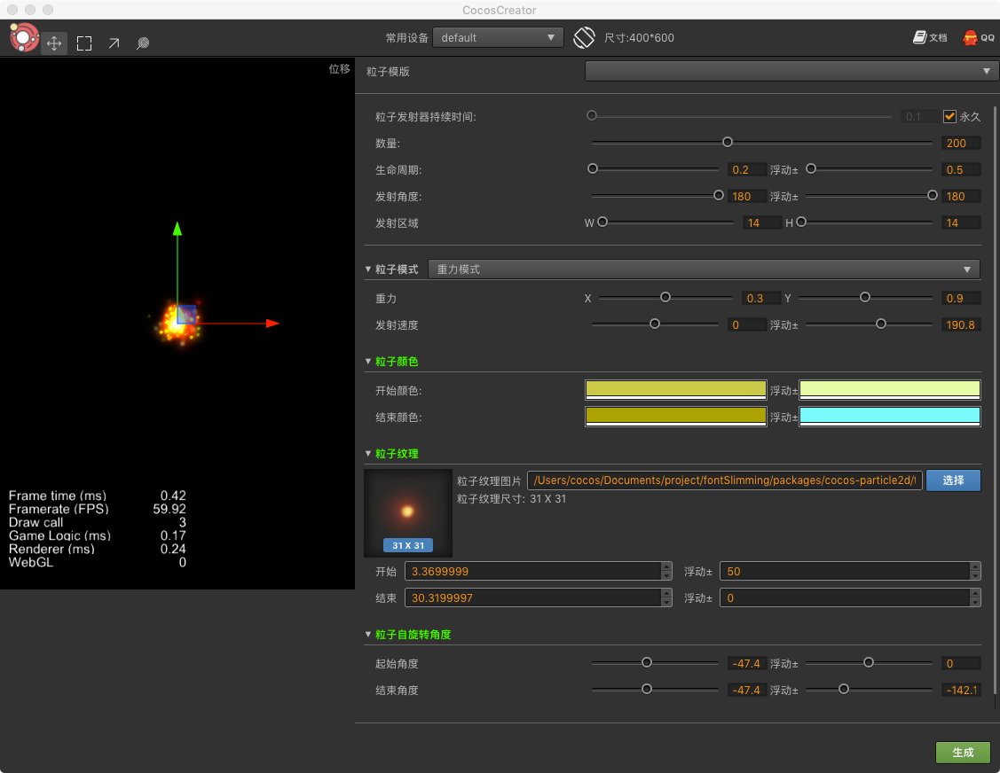

# 粒子编辑插件

一款编辑粒子的插件,和市面上的粒子编辑器区别不大,里面又加入了作者自己对参数的理解,更方便非程序人员使用,快速调整出来自己想要的粒子效果

## 使用说明
- 部分粒子参数进行了可视化图形操作
- 内置了大量粒子模版,可在模版的基础上快速调整出来粒子效果
- 粒子纹理支持直接拖拽
- 生成的粒子文件*.plist,*.plist文件名以纹理图片文件名为准
    - 比如你的纹理图片叫做star.png,那么最终的粒子文件为sun.plist, sun.png
- 更多建议,请QQ联系作者,谢谢支持    