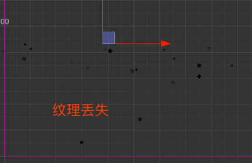
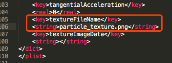
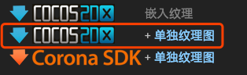

# 美术资源制作规范参考

## 粒子特效文件

特效尺寸一般和游戏分辨率关系比较大，通用的粒子特效要视情况而定，  
下雨下雪这样的因为是全屏效果，做成最大尺寸即可，一般2000*2000基本满足需求   
一般提供的粒子文件包含:
```
*.plist
*.png  
```
2个文件,如果只提供一个plist文件,把纹理存到plist,可能会发生如图的情况   
  
一般来说plist(标准的xml格式文件)文件里面会包含一个key(textureFileName)字段指向你所使用的png,如果需要修改请自行保持和纹理文件名一致    


如果使用的是网站  http://www.effecthub.com/particle2dx   
提供的粒子编辑器,那么导出选项,一定要选择单独纹理图   


### 注意
虽然市面上有许多粒子编辑器,但是真正能够被creator所完美适配的格式不多,所以,使用其他第三方编辑器制作的粒子,最好手动导入到creator中,另存一份.

## 序列帧
有待补充...