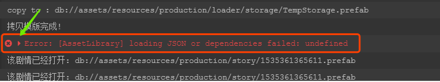
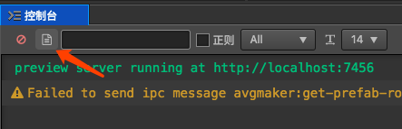
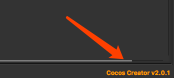
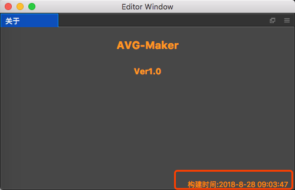

# 关于BUG
使用过程中难免遇到BUG,一个成熟的软件不知要经历多少次的优化迭代,插件也不例外,开发工程师也是常人,仅凭一个报错截图,很难准确定位原因,因此需要更多关于这个bug的信息

## 反馈bug需要提供的信息

- 提供截图,在creator中尽量打开详细的信息,即那个**展开标志**

- 编辑器中的所有操作日志,creator都有记录,如果方便,可以将这个文件发送给软件开发相关人员

- 最重要的不要忘了,你所使用的creator版本,在编辑器右下角有版本信息

- 插件的构建时间,可通过打开 **AVG-Maker**=>**关于插件** 查看

- 尽可能的描述产生该bug之前的最近几步操作
- 如果方便,可以将项目打包,然后发送给相关人员,这对bug的排查非常有利,so,开发人员也会优先解决这种bug,当然,开发相关人员也要严格遵守相关保密制度,信任是彼此的.
