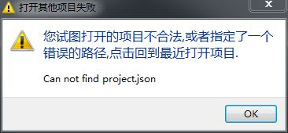
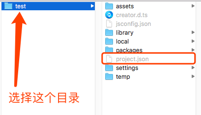
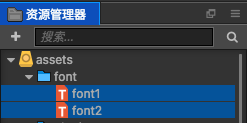

# 常见问题

## 为什么我的项目打不开了,出现如下提示:    
      
造成这个问题可能是因为你打开的项目文件结构有问题
    
也就是说目录里面必须包含project.json,当creator新建项目都是包含该文件的

## 如何添加自定义的字体    
插件目前仅仅提供了一些字体文件,如果想要使用自己喜欢的字体文件,可以按照如下步骤进行自行添加
1. 下载自己喜欢的字体文件,文件类型必须是*.ttf
2. 导入到项目资源中,将下载的字体文件直接拖拽到assets目录下的任何目录   
   
原则上尽量自己建立一个字体文件存放目录,方便统一管理
3. 在字体文件选择列表里面选择自己刚刚导入的字体文件就行了
4. 特别需要注意的是,尽量一个作品不要使用过多的ttf字体,这样会导致作品的资源体积变大,因此请慎重使用ttf字体

## 登录七牛云存储一直提示失败
总是提示
    
    getaddrinfo ENOTFOUND rsf.qbox.me rsf.qbox.me:80
    
修改hosts

    183.95.81.3	rsf.qbox.me
    
    
- windows:   C:\Windows\System32\drivers\etc
- mac : 使用finder打开目录：  /etc/hosts    