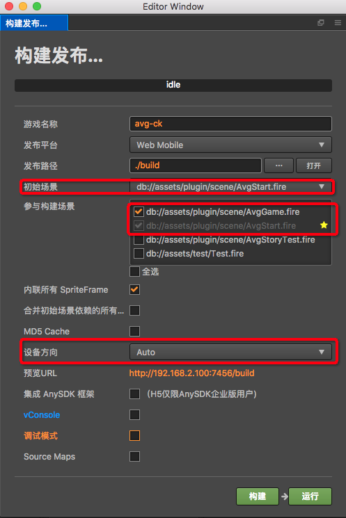

# 作品发布

## 发布Html5游戏

目前并没有做发布的封装,需要自己手动进行发布,发布流程如下

- 在菜单中选择**项目** => **构建发布**, 打开构建发布面板
- 面板参数设置如下   
  
    - 初始场景,选择**AvgStart.fire**
    - 参与构建场景,选择**AvgGame.fire**,**AvgStart.fire**,其余场景不需要,勾选不会影响游戏本身,只会增加游戏发布体积大小
        - 黄色的星星代表**初始场景**
    - 设备方向: 尽量勾选和自己设置的游戏设计分辨率一致的方向
        - 自己的作品为横屏,勾选**Portrait**
        - 自己的作品为竖屏,勾选**LandSpace**
        - 如果选择Auto,可能会出现一些未知问题,在游戏设计分辨率已知的情况下,尽量避免使用这个选项    

- 点击**构建**,即可完成作品的生成工作,作品最终会存放在**发布路径**下
- 如需预览,点击**运行**即可进行作品预览

### 如何把作品共享给别人
通过以上的发布操作,最终会在**发布路径**下生成一份标准的h5游戏作品,只需要把这个h5作品部署到一台服务器上,他人通过提供h5的网页链接,即可欣赏该作品    
