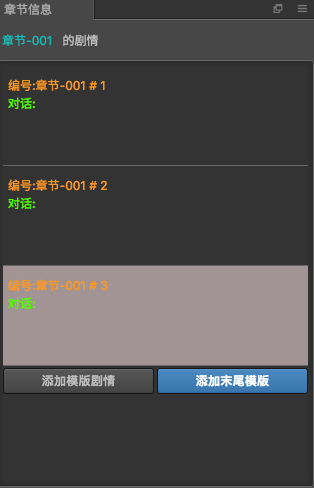

# 章节信息  

章节信息显示了当前章节所有的故事版内容,在信息面板中增加了部分显示元素
-  编号: 插件自动对没个故事进行排序编号,方便标识
-  对话: 人名+对话, 更方便观察该故事的内容
    - 目前存在的问题是: 不能主动获取到人名和对话,当发生人名对话编辑操作的时候,会进行面板刷新
    
## 快捷操作

## 双击
当双击每个故事的时候,会自动复制当前双击的故事,然后插入到该故事后边

## 右键
在故事里面鼠标右键会有三个菜单
- 复制: 复制当前故事
- 粘贴: 将复制的故事粘贴到当前故事之后
- 删除: 将当前的故事删除

## 拖拽故事
如果想要调整故事之间的顺序,可以鼠标拖拽每个故事进行排序,当拖拽到故事版的时候,会有放到前后的提示线

     