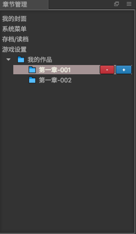
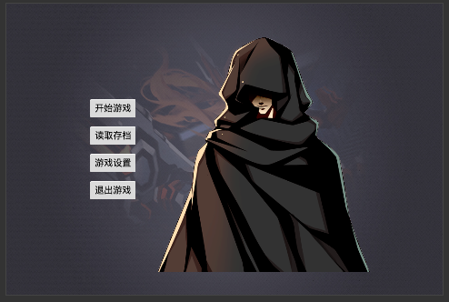

# 章节管理

该面板为管理avg所有的故事章节   

该面板和[章节信息](chapter-info.md), [属性信息](inspector-info.md)面板联动,共同完成作品的编辑

其中**我的作品**里面列出了作品中包含的所有章节信息

## 我的封面
游戏运行时启动的第一个画面,大致回事这个样子

包含了
- 开始游戏
- 读取存档
- 游戏设置
- 退出游戏

## 系统菜单

...

## 存档/读档
...

## 游戏设置
...

