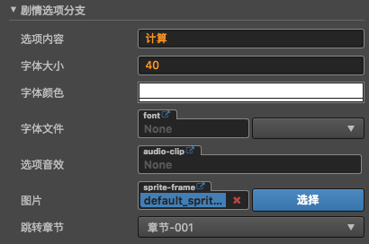
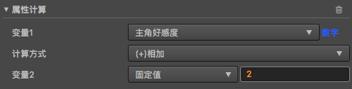
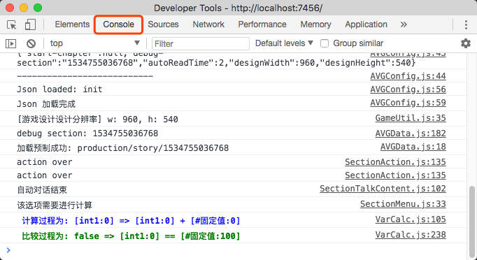

# 剧情跳转
提供剧情跳转的功能

 

## 面板组件
### 剧情选项分支

### 属性计算组件 

属性计算变量来源于[属性管理面板](../property-mgr.md),在属性管理面板中添加自己想要添加的变量,即可在该组件中进行操作   

#### 1.参与运算的参数
- 变量1: 计算表达式的左值
- 计算方式: 计算表达式的计算方式
- 变量2: 计算表达式的右值

#### 2.计算过程为
    变量1 = (变量1) (计算方式) (变量2)
#### 3.关于计算结果
每个属性计算组件都是相互独立的,计算结果并不影响作品流程,如果想控制流程,请参考**属性比较组件**    

### 属性比较组件

#### 1.参与比较的参数
- 比较对象1: 比较的左值
- 比较条件: 比较的方式
- 比较对象2: 比较的右值

#### 2. 比较过程为
    组件比较结果 = (比较对象1) (比较方式) (比较对象2)
#### 3.关于比较的结果
比较的结果必将是一个**布尔类型**(非真既假)的数值,如果条件成立,那么章节将执行跳转操作.
##### 3.1只存在一个属性比较组件
    最终比较结果 = 组件比较结果1 
##### 3.2 存在多个属性比较组件
    最终比较结果 = 组件比较结果1 && 组件比较结果2 && ... && 组件比较结果N

# 属性进阶
目前支持的属性类型为: 
- 数字类型:  
- 字符串 
- 布尔
    
## 举例说明

## 如何根据选择改变属性
    
在上图中, 我们在属性管理里面增加了一个变量**主角好感度**的数字变量,并设置初始值为0,
那么在运行过程中,调试信息如下:    
  
观察发现计算步骤为:
- 设置的**变量1**会和**变量2**进行一次计算,产生结果A 
- 将上一步产生的结果A赋值给**变量1**

## 如何控制某个属性不满足某些条件,剧情不予跳转
属性比较组件设置如图: 

比较日志如图: 

   

比较步骤:
- 将**比较对象1**现在的值和指定的**比较对象2**进行一次比较,产生结果B
- 最终产生的结果B必将是一个布尔值,该值将作为章节跳转与否的判断依据
- 如果存在多个比较组件,那么最终结果将是每个比较组件结果B的[与逻辑](https://baike.baidu.com/item/%E9%80%BB%E8%BE%91%E4%B8%8E/10993695)的集和

#### 变量计算日志

游戏在浏览器运行过程中,如果选项添加的属性计算组件,那么会在浏览器控制台打印出来变量计算,比较过程,方便及时掌握属性的运算情况.

如何打开浏览器控制台:
- 一般浏览器F11都会进入到开发者模式,在开发者模式中找到 **Console**

- 如果浏览器屏蔽了开发者模式,请自行百度**xx浏览器如何打开开发者模式**,一般情况下,会在浏览器的菜单栏中有相关菜单打开开发者模式

