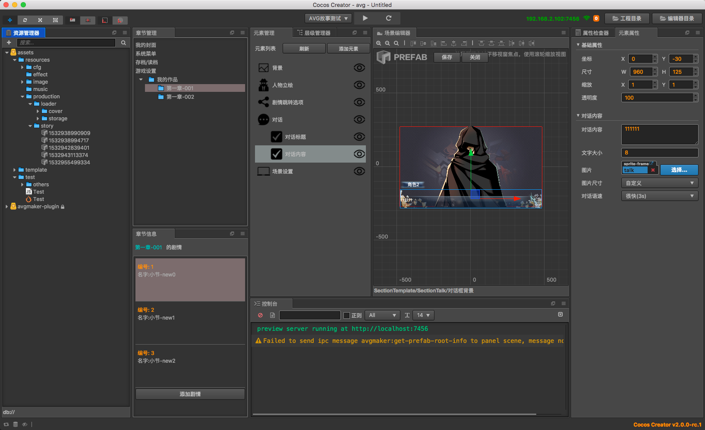
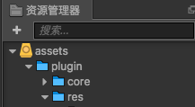

# 使用说明
## 插件总览

## 重点注意
- 禁止在**资源管理器**进行文件删除操作!由此导致的插件bug,自行承担!   
     
  
## 关于版本问题
- 作品开发过程中,一旦确定使用了某个版本,那么不建议再更换其他版本
- 某个版本发布后后续维护工作只负责bug修复,不进行功能追加
- 新功能会在大版本中加入  

## 插件菜单
- 插件初始化
- 章节管理
- 章节信息
- 元素管理
- 元素信息
- 角色管理
- 插件设置
- 模版管理

