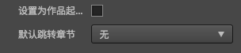
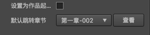

# 元素信息
该面板提供了一些avg元素的属性展示
## 章节属性
每个章节提供的功能如图   
    

- 设置该章节是否为整个故事的起始章节
    - 如果设置为起始章节,那么会在章节名会变为绿色
- 设置该章节的跳转章节
    - 当设置跳转章节为自身的时候,插件会有确认提示,请务必仔细考虑这种死循环,很可能会给作品流程造成一个死循环
    - 如果没有设置跳转章节,那么很可能整个故事会在此处终结,默认会跳转到故事结束
    
## 元素属性
待完善...
