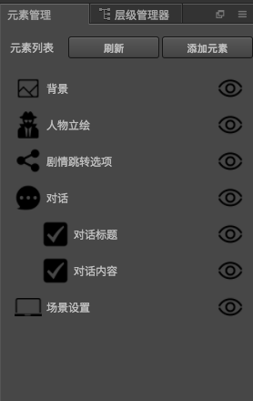
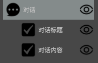
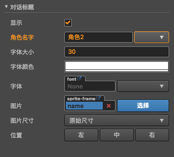
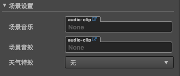
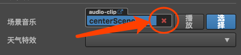

# 元素管理

目前可添加的元素包括
## 背景
待完善...

## 人物立绘
待完善...

### 跳转选项
待完善...

## 对话
   
提供显示,编辑该故事的对话内容,对话角色  

对话包含2部分内容 
### 对话标题

  
- 在**角色名字**属性栏,提供了快速选择角色名字的下拉列表,其中下拉列表项,是在[角色管理](role-mgr.md)里面配置的
- **字体**属性,目前插件给出了2款字体,如果不能满足需求,可自定义[添加自己的喜欢的字体](../issue/index.md#如何添加自定义的字体)

### 对话内容
  

## 场景设置

- 场景音乐: 设置进入该故事的时候,播放的背景音乐,默认为循环播放
    - 假如故事A设置了背景音乐A,故事B设置了背景音乐B,那么当故事A跳转到故事B的时候,背景音乐也会变为背景音乐B,也就是说如果故事B没有设置背景音乐,那么将一直播放上次设置的背景音乐.
    - 如果该故事不需要设置背景音乐,点击图中的**X**即可
    
- 场景音效: 当进入该场景的时候播放的音效
    - 默认为只播放一次
    - 当场景切换后,即使音效设置为循环模式,也会被清理掉    
- 天气特效: 进入该故事的时候,展示的天气效果
    - 如果要控制天气特效始终在最上边,请务必将**场景设置**元素拖至最下面

