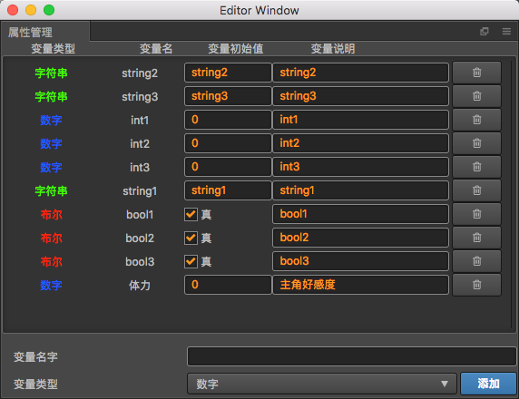

# 属性管理

## 注意事项:
- 使用变量之前,必须首先添加变量
- 已经添加好的变量,请小心谨慎的进行删除操作
- 修改变量的描述,可能会混淆变量的使用,所以,请给变量一个正确的描述,不要过长

## 已知问题:

因为属性的增删改查操作同时也会影响相应组件,所以,如果出现属性选择列表里面没有出现自己刚刚添加的属性,可能是刷新问题导致的bug,目前没有更好的解决方案,只能通过刷新下拉列表所在面板内容或者重启creator解决