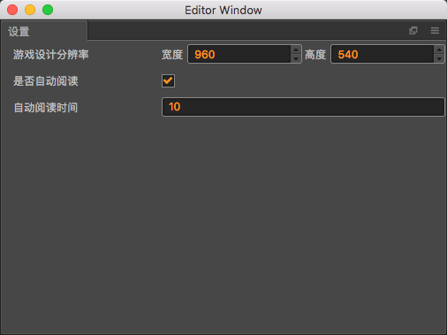

# 插件设置    
     
## 游戏设计分辨率:  
因为游戏的运行环境千差万别,在不同的设备上运行显示的窗口大小也不一致,但是在游戏开发过程中,不可能为每套设备都开发一套资源,于是**游戏设计分辨率**这个概念就应运而生.
    
设定一个游戏设计分辨率,所有的作品都是在该分辨率下进行制作,创作者无需关心在其他设备上的适配情况,适配工作交给引擎完成.  

当然这个设计分辨率也不是随心所欲设置的,这个值要考虑到[市面上主流机型](../../data/phone-pixi.md)的分辨率,这样才能保证作品在主流机型上有一个比较好的效果,至于非主流机型,可能就要单独深入的做适配方案.

## 自动阅读功能
开启该功能,在每个故事完成对话之后,会进行自动阅读,在配置的自动阅读时间内如果没有进行后续的故事阅读,那么作品将自动进行作品的阅读

  
