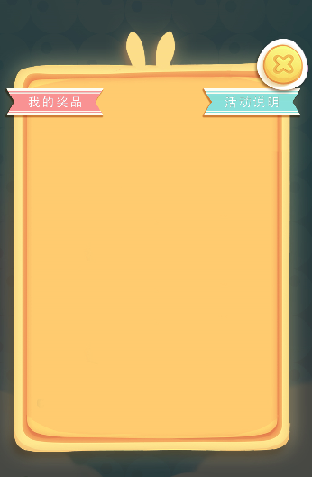
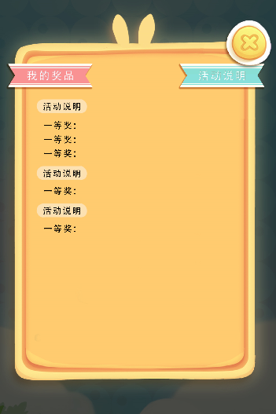
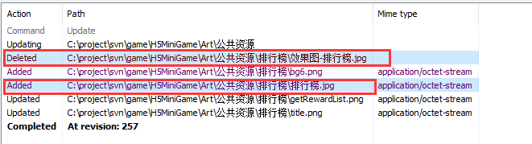
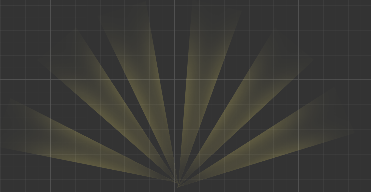
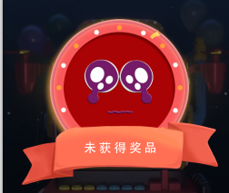
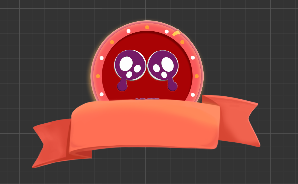

# 开发基本要求
1. UI布局严格按照策划文档作图,禁止私自修改,如需改动,和策划协调后,同步更新参考图和策划文档!  
2. 美术资源有更新变动,应该及时更新效果图!  
3. 参考图为游戏实际运行的该模块完整画面,或者和游戏实际画面相似度极高,界面上的所有元素必须在参考图中都有所体现，而不是仅仅给出游戏部分参考!   

  
4. 所有图片一律使用png格式，禁止使用jpg等其他格式，虽然jpg能够显著降低图片体积大小，但是实际项目开发中，经常发生文件名后续经常被篡改的情况，综合考虑，禁止使用非png的文件存储格式。
5. 一个资源如果在初始版本中已经确定了具体名字,后续版本禁止私自修改提交上传,例如,一个按钮在初始版本中叫做btn1.png,那么在开发过程中,更新这个按钮图片,是禁止修改其名字的,不允许在后续版本变为其他名字!   
例如:    
  
可以看到红框里面的为同一个资源,但是开发者在此次提交过程中做了删除操作,然后更换了名字,又再次上传了,这是一个很严重的开发错误.

6. 关于重复资源如何切图    
如果一个图片的组成具有重复,那么就要考虑给出重复的单元即可,无须给出整体    
比如这个效果图中的光线    
  
如果交付的资源如下图所示,是完全不符合要求的,如果背景框小于空余尺寸,会很滑稽可笑的         
  
如果每条光的形态不一(非斜切,拉伸能够实现的效果),那么给出整体即可   
   
如果每条光的形态统一,给出单元部分(不能有斜切,拉伸)即可,如图所示   
   
特别需要注意的是,光的起始点最好是在尺寸的中间!   
其他注意事项:    
    - 如果光线尾部为渐变消失样式,给出原始光线尺寸就行(一般推荐这种样式的光线)  
    - 如果光线尾部是实线,那么给出的光线尺寸要尽可能的长,否则,程序运行过程中会出现画面bug    

7. 文件夹必须显示图片扩展名，方便识别文件类型。
8. 美术交付的资源要和效果图一致，禁止出现部分资源出现缩放问题。  
例如，美术交付的效果图为：  
    
而程序用所使用的资源，发现这个红圆圈始终无法拼出效果图的效果，发现红圆圈的尺寸存在问题：       
   