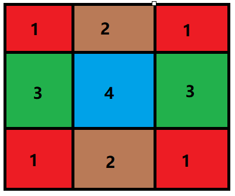
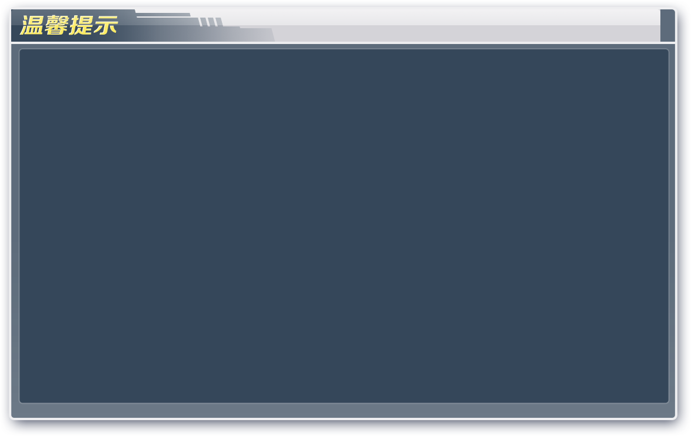
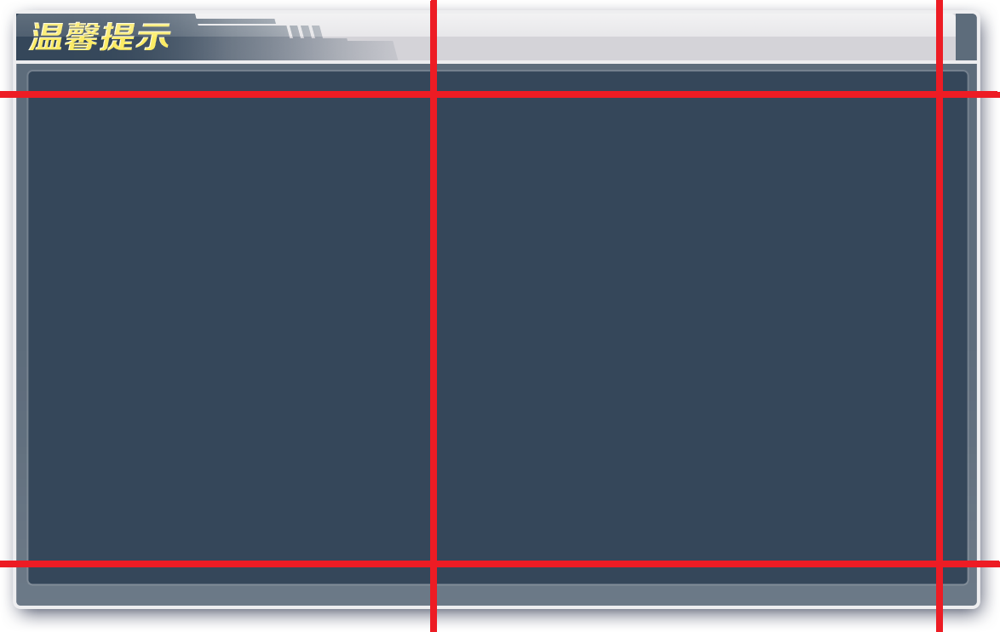
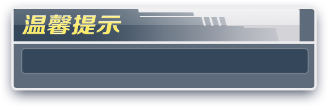
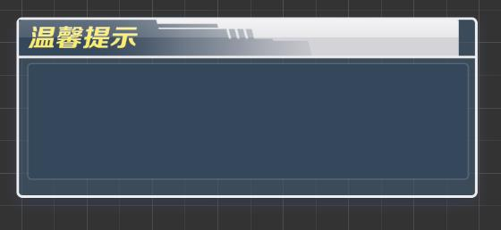
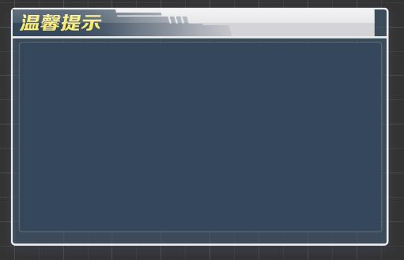
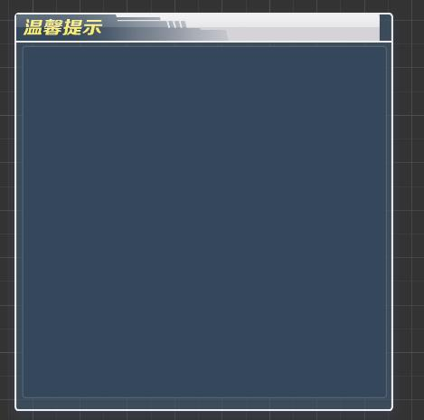
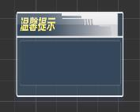

# 九宫格
- 也叫点九图，是游戏、app等开发过程中常用的一种技术。
- 游戏开发中需要制作九宫格的界面,一般为带有可拉伸的对话框,按钮等
- 更多关于九宫格的说明[点击查看](http://baijiahao.baidu.com/s?id=1586109785156137907&wfr=spider&for=pc)

## 关于什么时候考虑制作九宫格图片
比如某张图片效果具有以下特征,一般都会考虑制作成九宫格

- 将一份图片随意划分为9份,如图所示
- 区域1始终保持原样
- 区域2可横向拉伸,不影响效果
- 区域3可纵向拉伸,不影响效果
- 区域4横向纵向拉伸,都不影响效果
- 一般来说区域2,3,4为纯色区域,是必须考虑制作为九宫格的

### 例子
拿对话框举例,游戏中对话框的样式都是相同的,仅仅是大小不同,如果每个大小的对话框都给一个资源,那么游戏的安装包体就无形中增加了,九宫格这时就派上了用场,美术只需要给出一张图,程序运用九宫格技术,即可实现不同大小的对话框复用同一个资源,大大减少了游戏的美术资源

比如这个对话框   
   
简单分析之后可以这样拆解:     
    
**最终交付给程序的图片资源为:**    
    
即
- 区域1原样保留
- 区域2、区域3、区域4，在保证不影响效果的前提下，仅仅保留了最小基本单元     
在程序中使用的情况为：    
    
    
    
需要注意的是，对话框的尺寸不能比九宫格的尺寸要小，否则会出现异常！   
  