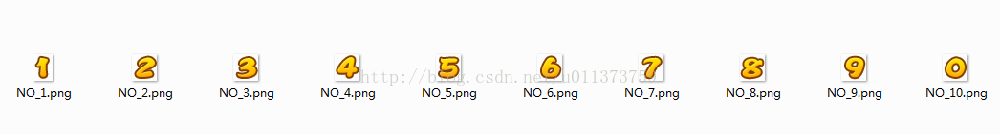
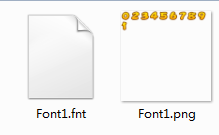

# BMFont位图
我们在制作游戏的过程中经常要使用各式各样的艺术字体，这些字体让我们的游戏看起来更加美观。

## 制作流程
1. 首先准备好你的艺术字体散图，如图所示

2. 下载安装[cocos creator](http://download.cocos.com/CocosCreator/v1.9.1/CocosCreator_1.9.1_win.exe.zip)。
3. 打开cocos creator，[下载插件](../../res/bitmap-font.zip)并[安装creator插件](https://github.com/tidys/CocosCreatorPlugins/blob/master/doc/installPlugin.md)，该插件为收费插件，因项目需要内部共享，请配合保密，谢谢合作，[购买地址](http://store.cocos.com/stuff/show/178913.html)。
4. 插件详细的使用说明[点击查看](https://github.com/tidys/CocosCreatorPlugins/blob/master/doc/bitmap-font/README.md)。
5. 最终交付给程序的文件为：     

6. 注意资源文件名。

## 常见问题
- 后续补充。。。

