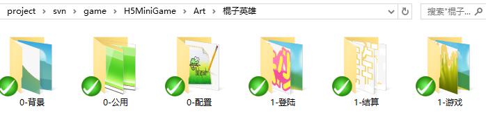
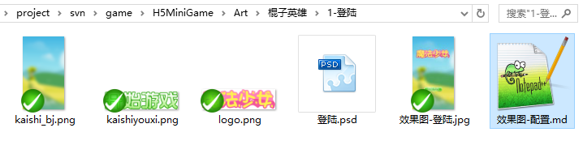

## 美术目录结构规范
示例：

### 说明
- 拆解的散图集中放到一个目录,方便查找,例如: 一个背景图由许多部分组成
- 目录规范
    - 0-* 标识公共资源目录
    - 1-* 标识模块资源目录
- 项目美术资源目录结构按照模块划分
    - 0-公用: 存放公用资源,比如按钮、装备icon图标，音频资源等等
    - 0-背景: 游戏中使用到的背景图
        - 一般都是一个整图.
        - 如果是散图拼合而成,需要提供散图和参考图
        
    - 0-配置: 存放美术相关配置文件,比如色值,字体大小等信息,文件格式不限,推荐文本格式为markdown格式
        - 黑色遮罩,由程序实现,美术提供色值,透明度即可
        
    - 1-模块目录(登录)     
    
        - 该模块各部分效果图,比如:效果图-登录.png,效果图-注册.png
            - 注意，必须使用 效果图-*.png ，保证所有的效果图集中在一个地方
        - 该模块使用到的散图,一般为png
        - 该模块的美术设计文件*.psd  
        - 配置文件： 该模块的配置文件，比如色值、字体大小等信息。
     