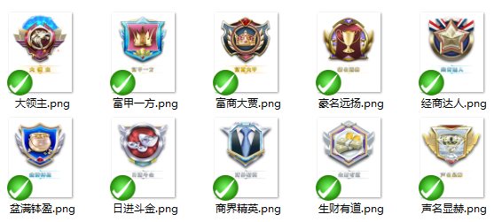

# 美术资源规范
- 交付的美术目录结构，一旦所有人员达成一致，要尽量避免修改目录结构。
- 交付给客户端的美术资源目录、图片名字只能使用字母数字和“_”，不允许包含中文、空格、（！@#￥%&*+）等特殊字符。
    -  特别注意：文件名中严禁出现空格，尤其空格出现在文件名尾部，例如 btn.png 和 btn .png，在隐藏文件扩展名的情况下，几乎看不来为什么windows允许2个同名文件存在！
- 每种类型icon系列的图片，尺寸必须严格一致，比如背包里面的物品icon，人物的技能图片icon，角色等级的图片icon等，例如：     
