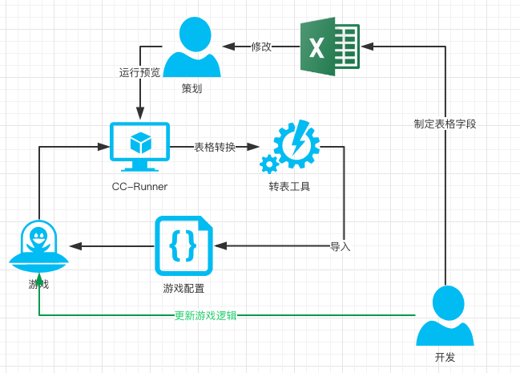

# CC-Runner
## 为什么会有该CC-Runner?
游戏开发过程中存在很多配置表格，每次策划填写完毕之后，都需要把表格扔给客户端，然后客户端用转表工具转换成json、xml等，接着客户端再把生成的配置导入到游戏中，然后发布一个版本，让策划验收，整个流程有点繁琐，于是诞生了该工具，这些琐碎的事情完全交给策划自己搞，没错，策划自己玩去吧！开发人员就应该专注于业务开发!

## 大致流程

如果没有工具支持,大致流程如下:

如果CC-Runner参与该流程,就是这个样子

开发人员完全从流程中解放出来,所有流程都交给了工具完成,开发人员更多的关注业务逻辑开发

