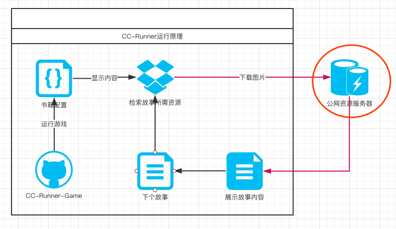
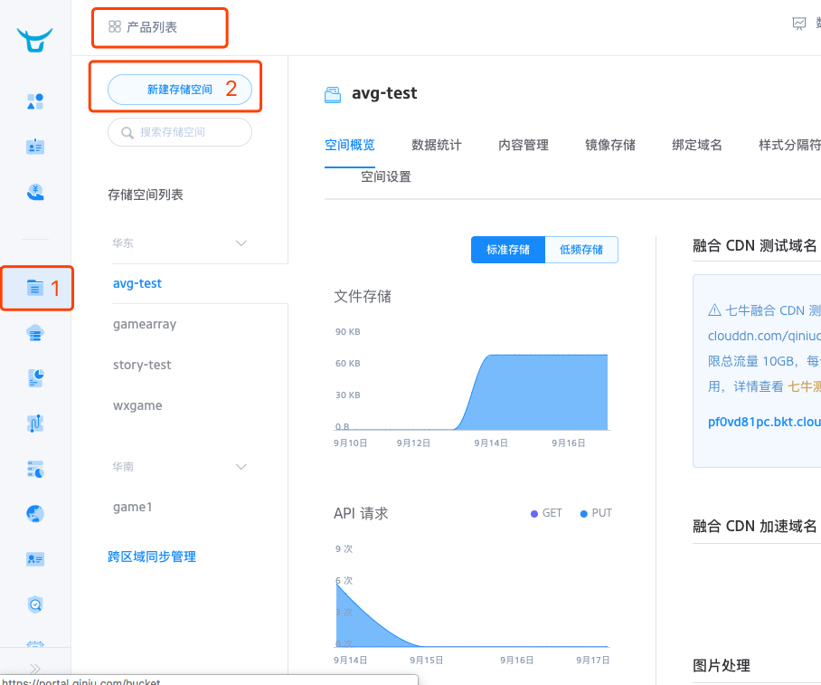
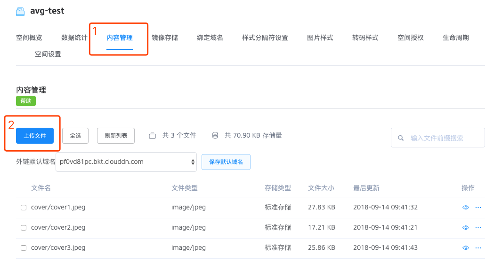
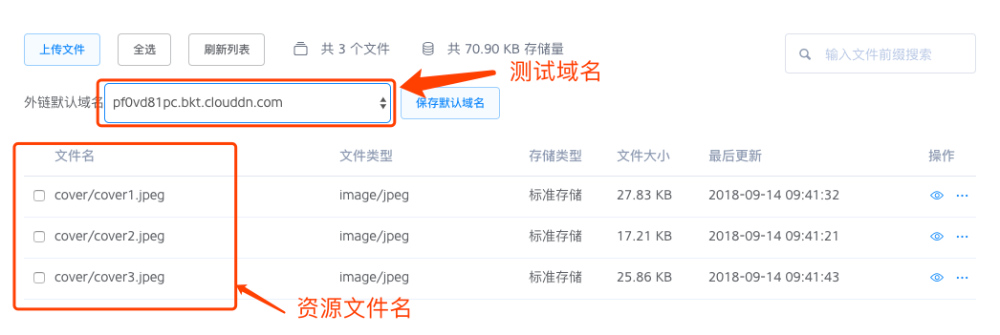

# 关于远程资源

## 我的游戏图片放到哪里?
图片资源是要存放到一台公网服务器上,有条件的可以向公司申请一个http服务器.

实际生产环境中,不可能每个人都会分配一个远程服务器,所以作者推荐大家使用免费的7牛云存储作为测试资源服务器

## CC-Runner运行原理

当游戏启动的时候,会获取一份配置表,通过配置表,游戏能够知道使用了哪些资源图片,然后会发起http请求下载使用到的图片,如果配置表的url有误,会导致图片下载失败,最终导致游戏图片不能正常显示,所以,cc-runner目前不支持脱机工作,必须在网络环境下才能正常工作,当时,你也可以手动搭建一个http服务器,来模拟一个网络环境.

### 使用步骤
1. 注册7牛账号: https://www.qiniu.com/
2. 打开控制台,选择新建一个存储空间

3. 在**存储空间列表**找到刚才新建的存储空间,选择**内容管理**,然后上传自己需要的资源图片

4. 外链默认域名就是测试域名,也就是[net.server](book.md#net) 和 [storyCfg.server](story.md#storycfg)字段

如果资源名包含有目录形式,如图在文件名中追加即可

## 后续计划
在后续开发中,工具会慢慢将该流程集成到cc-runner中,提高内容生产效率