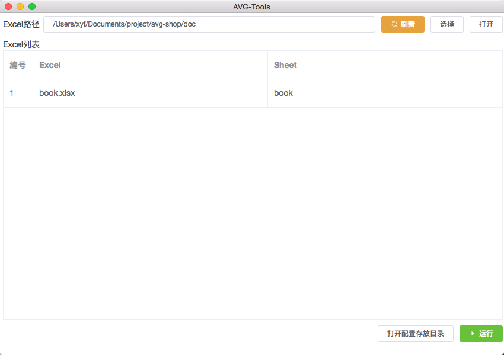
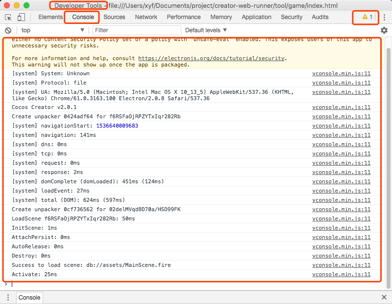

# 使用说明
工具主界面

## 使用步骤
1. 点击**选择**按钮,选择Excel所在的目录
2. 在**Excel列表**中列出了目录下包含的所有Excel-Sheet
3. 检查Excel没有问题,点击**运行**按钮,弹出新窗口即可预览游戏

## 其他说明
- 如果Excel内容发生变动,尤其是Sheet增加删除,并不会立刻反馈到**Excel列表**里面,需要自己主动点击**刷新**按钮
- 如果预览游戏过程中出现没有反应,黑屏等现象,可能是配置错误导致,也可能是游戏逻辑bug,请联系相关人员进行反馈
- 图片目前需要上传到云端,如果你手上没有云服务器,那么推荐[使用免费的七牛云存储](remoteRes.md)

## 反馈说明
- 点击菜单**开发者**=>**开发者**会弹出当前**Developer Tools**,如果**Console**有报错,请一并截图提交给相关人员即可

